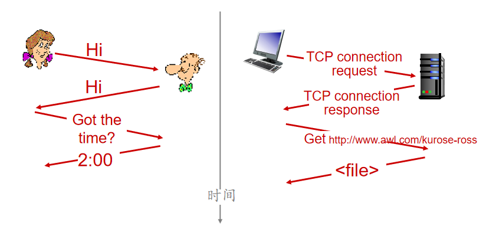

<!--
 * @Descripttion: 
 * @version: 
 * @Author: WangQing
 * @email: 2749374330@qq.com
 * @Date: 2019-12-01 15:23:39
 * @LastEditors: WangQing
 * @LastEditTime: 2019-12-01 16:22:44
 -->
# 什么是因特网？

## 具体构成描述

**因特网**是一个世界范围的计算机网络，即它是一个互联了遍及全世界数十亿计算设备的网络

这些设备称为**主机**或**端系统**

端系统通过**通信链路**和**分组交换机**连接到一起

- 通信链路：同轴电缆、铜线、光纤、无线电频谱
- 分组交换机：路由器、链路层交换机

端系统通过**因特网服务提供商-ISP**接入因特网

端系统、分组交换机以及其他因特网部件都要运行一系列**协议**

## 服务描述

- 向应用程序提供服务的基础设施
- 向应用程序提供编程接口

## 什么是协议

