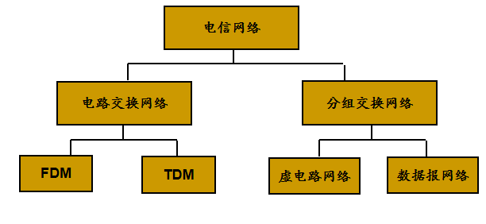
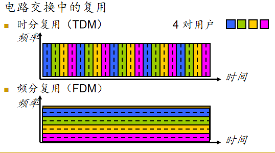
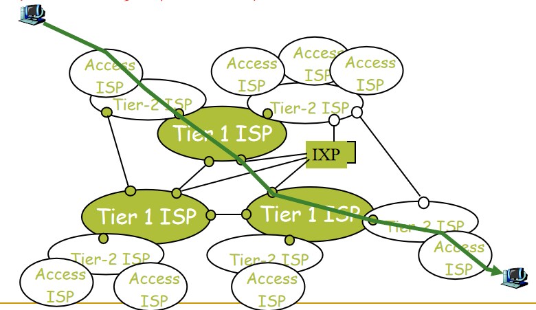

<!--
 * @Descripttion: 
 * @version: 
 * @Author: WangQing
 * @email: 2749374330@qq.com
 * @Date: 2019-12-01 16:39:41
 * @LastEditors: WangQing
 * @LastEditTime: 2019-12-01 16:48:14
 -->
# 网络核心

## 电路交换网络

## 分组交换网络

1. 在发送端，先把较长的报文划分成较短的、固定长度的数据段
2. 每一个数据段前面添加上首部构成分组
3. 分组交换网以“分组”作为数据传输单元
4. 依次把各分组发送到接收端（假定接收端在左边）
5. 接收端收到分组后剥去首部还原成报文
6. 最后，在接收端把收到的数据恢复成为原来的报文

## 分组交换VS电路交换

- 若要连续传送大量数据，且其传送时间远大于呼叫建立时间，则采用在数据通信之前预先分配传输带宽的电路交换较为合适
- 分组交换不需要预先分配传输带宽，在传送突发数据时可提高整个网络的信道利用率

## ISP和因特网主干

