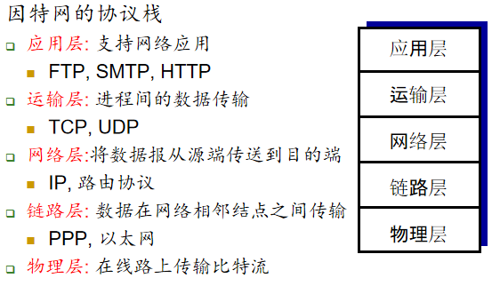
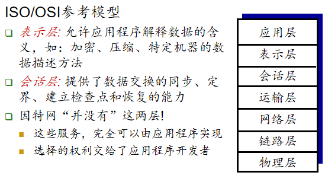
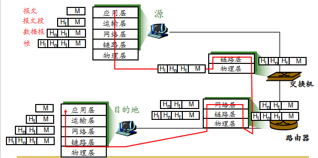

<!--
 * @Descripttion: 
 * @version: 
 * @Author: WangQing
 * @email: 2749374330@qq.com
 * @Date: 2019-12-01 16:55:06
 * @LastEditors: WangQing
 * @LastEditTime: 2019-12-01 17:01:01
 -->
# 协议层次和服务模型

## 因特网协议栈

## ISO/OSI参考模型

## 封装

