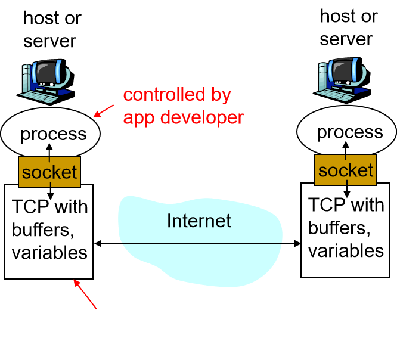

<!--
 * @Descripttion: 
 * @version: 
 * @Author: WangQing
 * @email: 2749374330@qq.com
 * @Date: 2019-12-02 16:05:35
 * @LastEditors: WangQing
 * @LastEditTime: 2019-12-02 16:43:37
 -->
# 应用层协议原理

## 网络应用程序体系结构

- 客户机/服务器体系结构**C/S**
    - 存在一个能够向客户机提供服务的服务器
    - 存在一个或者多个主动连接服务器，试图从服务器获取所需服务的客户机
    - **客户机之间不能互相通信**
    - **为提高服务器的处理能力，通常采用服务器集群**
- **P2P**体系结构
    - 任何一方既提供服务又享受服务
    - 节点之间可以直接通信
    - 节点的地址以及他们之间的连接可能随时发生变化
    - **P2P体系结构非常容易扩展，但也特别难以管理**
- 混合体系结构
    - ```P2P```和```C/S```的混合体

## 应用层协议

- 交换的报文类型
- 各种报文类型的语法
- 字段的语义
- 确定一个进程何时以及如何发送报文，对报文进行响应的规则

## 进程通信

- 进程通过套接字来接受和发送报文
- 套接字相当于一个通道
    - 发送进程将报文交给套接字
    - 套接字将这些报文传输到接受进程的套接字
    - 长度为48位，32位IP+16位port



## 运输服务

- 如何选择运输服务
    - 数据的可靠传输
    - 吞吐量（带宽）
    - 定时（时延）
    - 安全性
- 运输层提供的两种
    1. TCP
        - 面向连接: 在客户端和服务器进程之间需要建立连接
        - 可靠传输 : 在发送和接受进程之间
        - 流量控制: 发送数据的速度决不超过接收的速度 
        - 拥塞控制: 当网络超负荷时，束紧发送端口，减缓发送速度
        - 不提供: 实时性, 最小带宽承诺
    2. UDP
        - 在客户端和服务器进程之间实现“不可靠的”数据传输
        - 不提供:连接建立, 可靠性保证,流量控制,拥塞控制,实时性, 最小带宽承诺
    - TCP/UDP天生不具备安全性