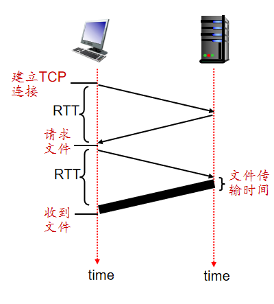
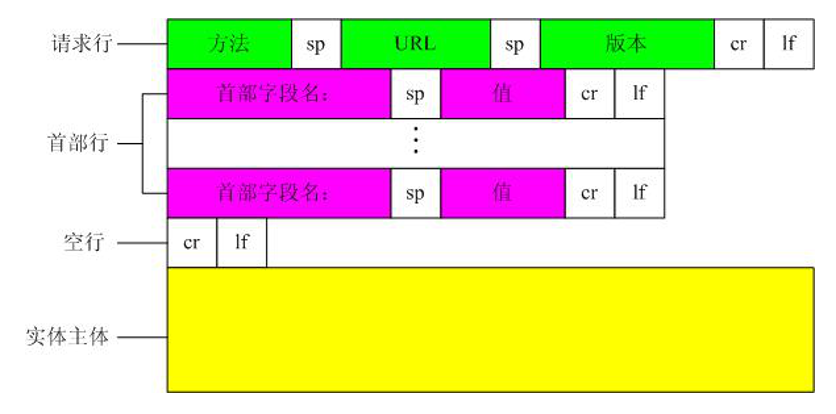
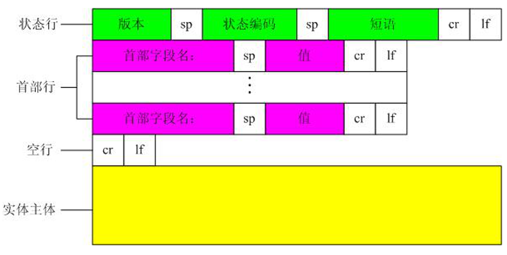
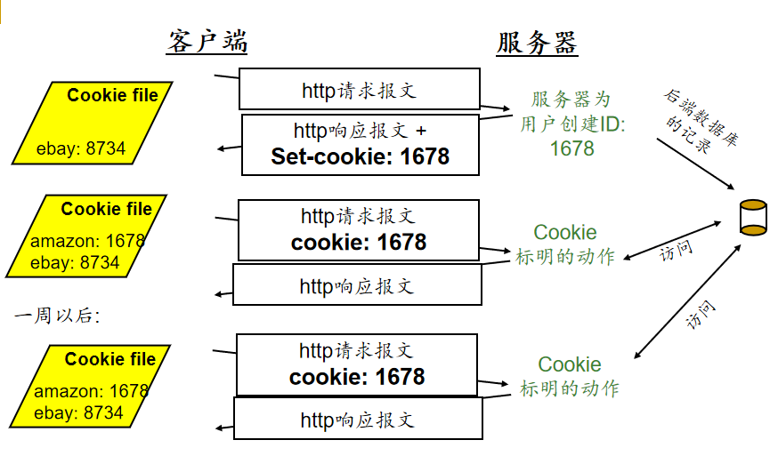

<!--
 * @Descripttion: 
 * @version: 
 * @Author: WangQing
 * @email: 2749374330@qq.com
 * @Date: 2019-12-02 16:44:22
 * @LastEditors: WangQing
 * @LastEditTime: 2019-12-02 17:20:38
 -->
# WEB和HTTP

## WEB

- C/S模式
    - WEB服务器
    - 浏览器

- WEB页面由**对象**组成
    - HMTL文件、JPEG图片等
    - 对象通过URL定位

## HTTP

- TCP传输服务
    - 客户端启动TCP连接(创建套接字) 到服务器, 端口 80
    - 服务器接受来自客户端的 TCP 连接
    - http 报文(应用层协议报文) 在浏览器 (http client) 和Web服务器(http server)之间进行交换
    - 关闭TCP 连接

### 非持续连接和持续连接

- 非持续连接-HTTP1.0
    - 假设用户键入了一个 URL ```www.hust.edu.cn/cs/home.index``` 请求10个jpeg图片
        1.  http 客户端启动 TCP 连接到```www.hust.edu.cn```上的http 服务器 (进程). Port 80 是 http 服务器的默认端口
        2. 在```www.hust.edu.cn``` 上的http 服务器在 port 80 等待 TCP 的连接请求.  “接受” 连接并通知客户端
        3. http客户端发送 http 请求报文 (包括URL) 进入 TCP 连接插口（socket）
        4. http 服务器接收到请求报文, 形成 响应报文 (包含了所请求的对象 ，cs/home.index), 将报文送入插口（socket）
        5. http 服务器关闭 TCP 连接
        6. http 客户端接收到了包含html文件的响应报文。分析 html 文件, 发现 10 个引用的 jpeg  对象
        7. 对10 jpeg objects 逐个重复1-5 步
    - 很多浏览器同时打开多个**并行的连接**来提交效率
    
    - 总时间 = 2 * RTT + 文件传输时间

- 持续连接-HTTP1.1
    - 服务器在发送响应后，不再断开TCP连接，而是保持该连接，用于后续对象的传送，直至该连接“休息”了一个较长的时间后，方断开该连接
    - 减少了对服务器端连接数的需要，从而减少了对服务器端套接字资源的占用，提高了服务器的负载能力
    - 持久连接又可以分为
        - 非流水线方式：一个对象传输完成方能传输下一个
        - 流水线方式：可以一次性发送所有请求，慢慢接收

### HTTP 报文格式

- 请求报文
    

- 响应报文
    

- 响应状态码
    - 200 OK: 请求成功
    - 301 Moved Permanently: 请求的对象被转移了
    - 400 Bad Request: 服务器不懂请求报文
    - 404 Not Found: 服务器上找不到请求的对象
    - 505 HTTP Version Not Supported: 服务器不支持请求报文使用的HTTP协议版本

## Cookie

- 目的
    - 限制用户的访问
    - 把内容和用户身份关联起来
- 组成
    - 在HTTP响应报文中有一个Cookie首部行
    - 在HTTP请求报文中也有一个Cookie首部行
    - 在用户的端系统中保留了一个Cookie文件，由用户浏览器负责管理
    - 在Web站点有一个后端数据库



