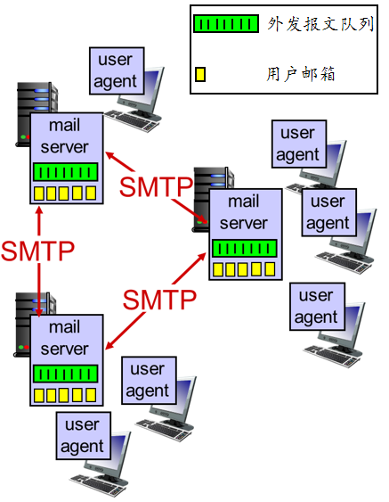
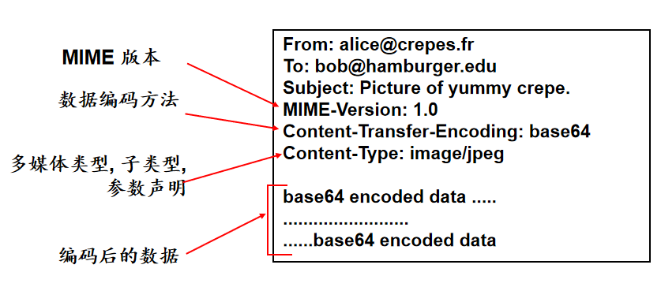

<!--
 * @Descripttion: 
 * @version: 
 * @Author: WangQing
 * @email: 2749374330@qq.com
 * @Date: 2019-12-02 17:21:34
 * @LastEditors: WangQing
 * @LastEditTime: 2019-12-02 18:34:00
 -->
# 因特网中的电子邮件



- 构成
    - 用户代理
        - 写作, 编辑, 阅读邮件报文
    - 邮件服务器
        - 邮箱 包含了收到的的用户邮件
        - 报文 队列包含了外发的邮件报文
    - 简单邮件传输协议
        - SMTP协议用在邮件服务器之间发送邮件

## SMTP协议

- 使用 TCP可靠的传送邮件报文, 端口25
- 直接传输: 发送服务器到接收服务器
- 传输的三个阶段
    - 握手(打招呼)
    - 报文传输
    - 结束
- 命令/响应交互
    - 命令: ASCII文本
    - 响应: 状态码和短语
- 邮件报文必须使用7-bit ASCII表示
- 一次邮件的传输过程
    - Alice使用用户代理发送消息给：bob@someschool.edu
    - Alice 的用户代理发送消息给她的邮件服务器；消息被保存在消息队列中
    - SMTP的客户端向Bob的邮件服务器建立一个TCP连接
    - SMTP的客户端通过这个TCP连接发送Alice的消息到Bob的邮件服务器
    - Bob的邮件服务器将这个消息存储到Bob的邮箱中
    - Bob使用他的用户代理阅读这个消息

## SMTP vs HTTP

- 都使用 ASCII 命令/响应交互, 状态码
- HTTP: pull（拉）
  SMTP: push（推）
- HTTP: 每个对象分装在各自的响应报文中
  SMTP:多个对象在一个多分部的报文中传送

## 邮件报文格式



## 邮件访问协议

- POP3协议
    - 客户端命令
        - user: 用户名
        - pass: 口令
    - 服务器响应
        - +OK
        - -ERR
    - POP3协议的交互命令
        ```
        list: 
            列出报文号码
        retr: 
            用报文号码取信
        dele:
            用报文号码删信
        quit
        ```

- IMAP协议
    - 将所有的邮件都保存在服务器上
    - 允许用户在服务器上组织自己的邮件目录
    - IMAP维护了IMAP会话的用户信息:
        - 目录名以及报文ID与目录名之间的映射关系

- HTTP