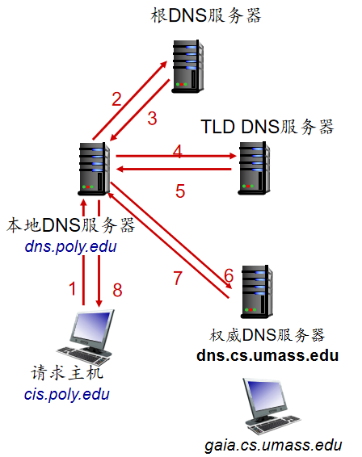
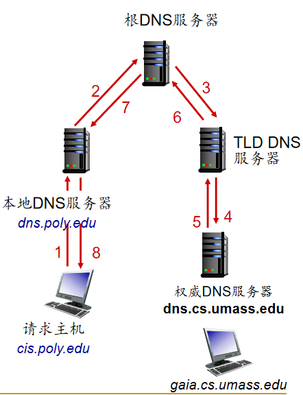
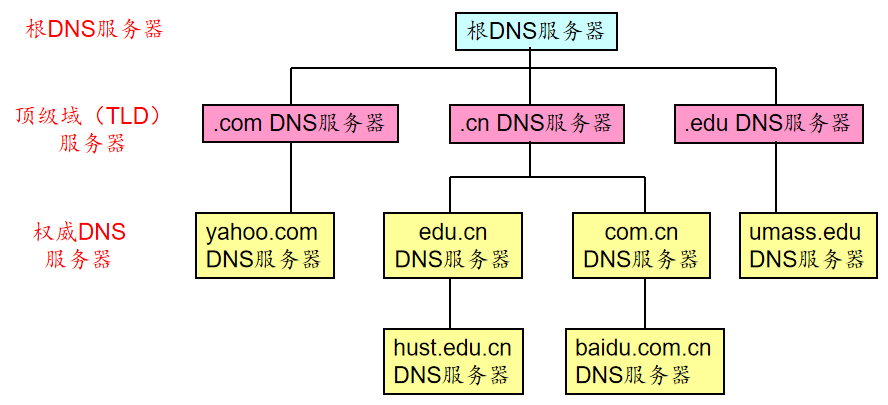

<!--
 * @Descripttion: 
 * @version: 
 * @Author: WangQing
 * @email: 2749374330@qq.com
 * @Date: 2019-12-02 18:34:45
 * @LastEditors: WangQing
 * @LastEditTime: 2019-12-02 18:52:34
 -->
# DNS:因特网的目录服务

## DNS概述

- DNS是一个分布式数据库，由很多台DNS服务器按照层次结构组织起来
- DNS运行在端到端系统上，且使用UDP协议（53号端口）进行报文传输，因此DNS是应用层协议
- DNS以C/S的模式工作
- DNS不直接和用户打交道，而是因特网的核心功能

## DNS解析过程

- 假设
    - Alice通过IE浏览器访问```www.hust.edu.cn/index.html```
    - Alice的主机上存在DNS客户机
- 结果
    - IE浏览器从URL中抽取出域名```www.hust.edu.cn```，将其传送给DNS客户机
    - DNS客户机向DNS服务器发出一个包含域名的查询请求报文
    - DNS服务器向DNS客户机送回一个包含对应IP地址的响应报文
    - DNS客户机将该IP地址传送给IE浏览器
    - IE浏览器向该IP地址所在WEB服务器发起TCP连接





## DNS实现



## DNS缓存

- 一旦 (任何) 域名服务器得知了某个映射, 就将其 缓存
    - 在一定的时间间隔后缓存的条目将会过期(自动消除)
    - TLD DNS服务器通常被缓存在本地DNS服务器中

## DNS记录

```RR格式: (name, value, type, ttl)```

- Type: A 
    - 主机名-->ip地址
- Type: CNAME
    - 变名-->真名
- Type: NS
    - 域-->该域权威域名服务器的主机名
- Type: MX
    - name-->邮件服务器域名