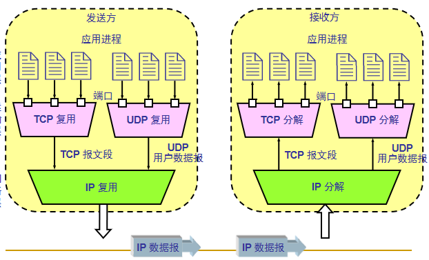

<!--
 * @Descripttion: 
 * @version: 
 * @Author: WangQing
 * @email: 2749374330@qq.com
 * @Date: 2019-12-03 14:43:23
 * @LastEditors: WangQing
 * @LastEditTime: 2019-12-03 15:27:00
 -->
# 多路复用与多路分解

将**主机到主机之间**的数据的交付**扩展**为运行在两个主机上的**进程间**的数据交付

- **多路复用**：多个进程通过各自端口将数据交付给运输层，共同使用运输层的服务
- **多路分级**：当运输层收到从下层网络层传递上来的数据后，通过端口号就数据向上交付给各自的应用进程

## 端口

- 一类是熟知端口，其数值0~1023。如HTTP:80
- 另一类为一般端口，用来随时分配给请求通信的客户进程
- 服务进程分配端口，客户进程系统随机分配端口
- 端口号16位，65536个端口

## 套接字

套接字 = ip + port

TCP连接的端点称为套接字

## 面向连接的复用和分解

- TCP套接字由一个四元组来标识
    - **源IP地址、源端口号、目的IP地址、目的端口号**
- 接收主机同时根据这四个值将报文段定向到相应的套接字
- 服务器主机同时支持多个并发的TCP套接字
    - 每个套接字都由一个四元组来标识
- Web服务器为每一个用户连接都产生不同的套接字
    - 非持久HTTP对每一个请求都建立不同的套接字

## 无连接的复用和分解

- UDP套接字由一个二元组来标识
    - **目的IP地址，目的端口号**
- 接受方根据目的端口号将报文段定向到相应的套接字
- **具有不同源IP地址/源端口的UDP报文如果具有相同的目的IP地址和端口号，则定向到相同的套接字**