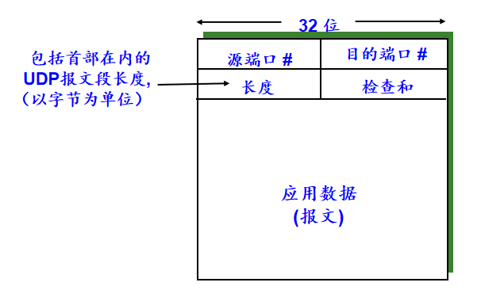

<!--
 * @Descripttion: 
 * @version: 
 * @Author: WangQing
 * @email: 2749374330@qq.com
 * @Date: 2019-12-03 15:27:16
 * @LastEditors: WangQing
 * @LastEditTime: 2019-12-03 15:54:10
 -->
# 无连接传输：UDP

## 功能

- 多路复用/多路分解服务
- 差错检查（**但不进行差错恢复**）
- 几乎没有对IP增加什么东西

## 流程

- 发送方
    - 从应用进程得到数据
    - 附加上为多路复用/多路分解所需要的源和目的端口号以及差错检测信息，形成报文段（数据报）
    - 递交给网络层，尽力而为的交付给接收主机
- 接收方
    - 从网络层接收报文段（数据报）
    - 根据目的端口号，将数据交付给相应的应用进程

**UDP通信事先无需握手，是无连接的**

## 优势

- 无需建立连接
    - 建立连接会增加时延
- 简单
    - 发送方和接收方无需维护连接状态
- 段首部开销小
    - TCP: 20Byte
    - UDP: 8Byte
- 无拥塞控制
    - UDP可按需要随时发送

## 缺陷

- 路由器中大量分组溢出
- 显著减少TCP通信的速率，甚至挤跨TCP会话

## 可靠的数据传输

- 在应用层实现数据的可靠传输
- 增加了应用进程的实现难度

## 报文段（数据报）结构

## UDP的检查和

- 目标
    - 检查收到的报文段的“差错”
- 发送方
    - 把报文段看作是16比特字的序列
    - 检查和：对报文段的所有16比特字的和进行1的补运算
    - 发送方将计算检验和的结果写入UDP校验和字段中
- 接收方
    - 计算接收到的报文段的校验和
    - 检查计算结果是否与收到报文段的校验的字段中的值相同
        - 不同 --> 检测到错误
        - 相同 --> 没有检测到错误，但可能错误

**最高有效位的进位要回卷到结果中**