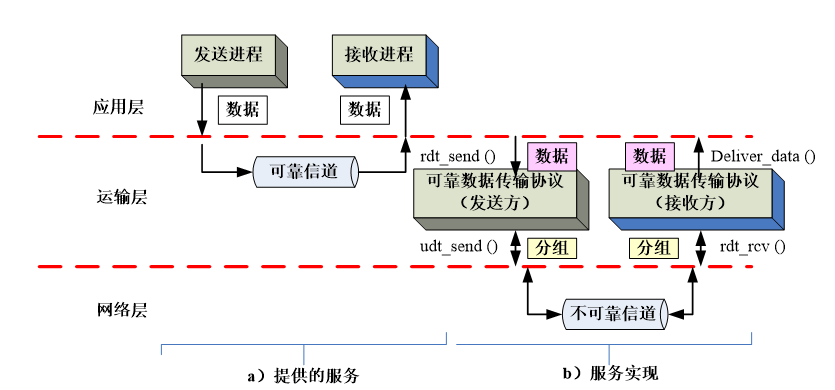
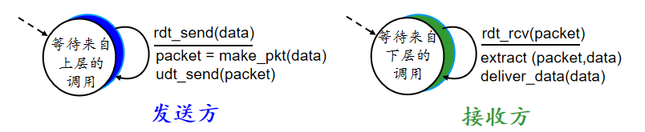
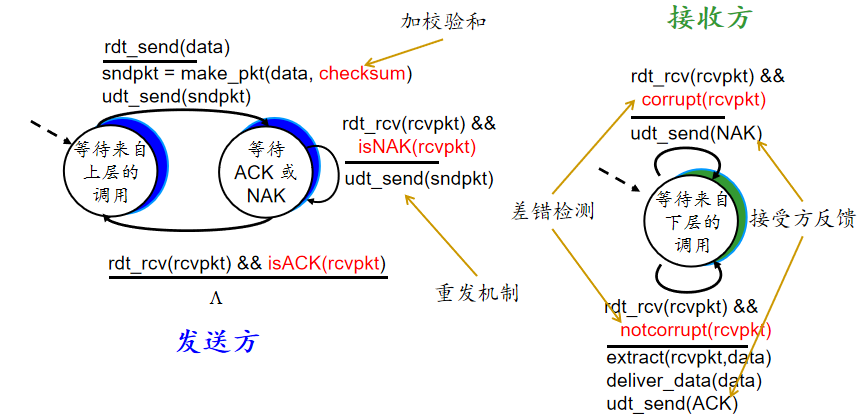
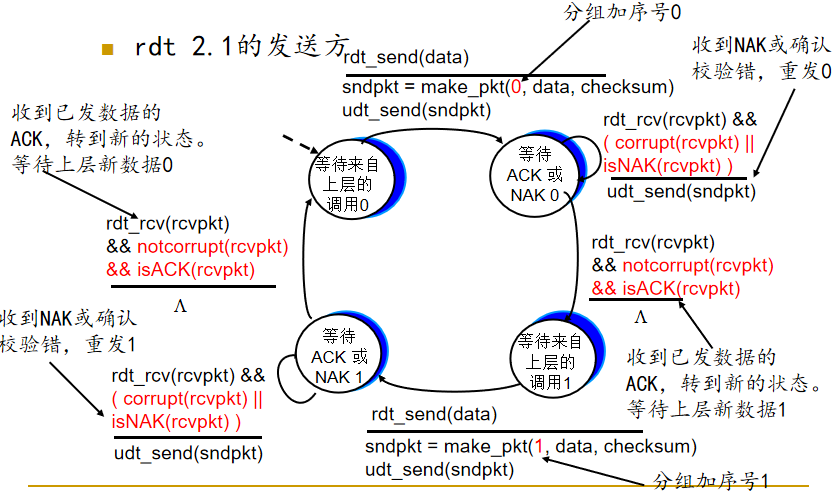
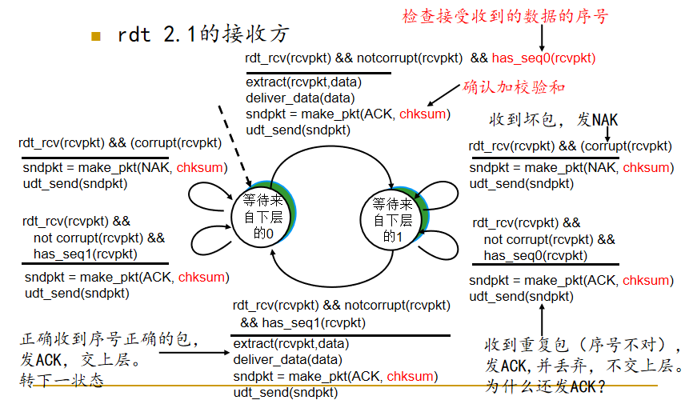
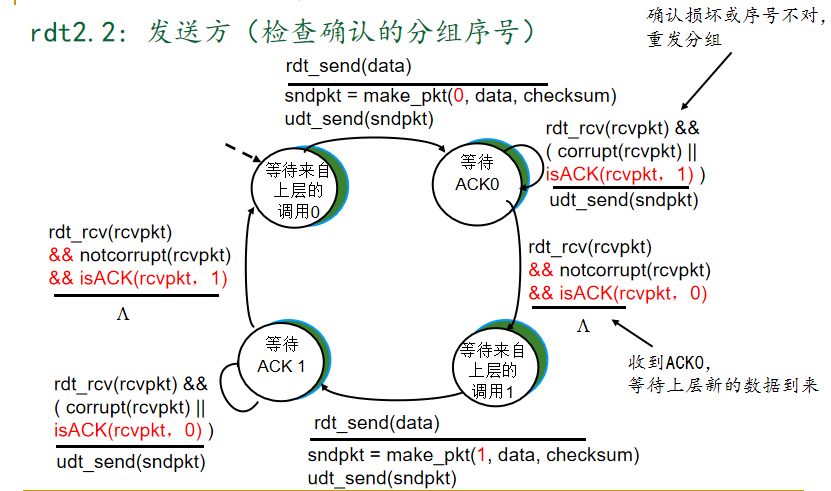
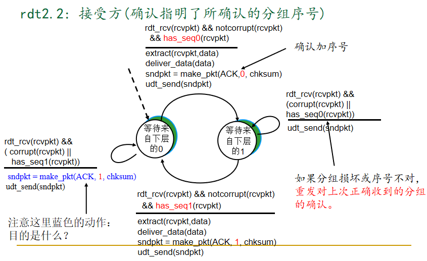
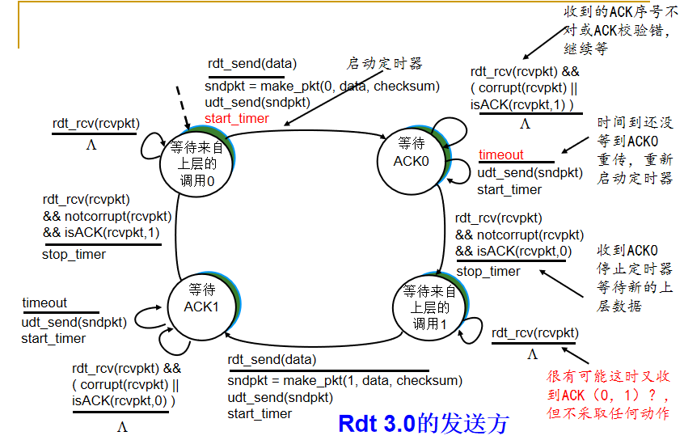

<!--
 * @Descripttion: 
 * @version: 
 * @Author: WangQing
 * @email: 2749374330@qq.com
 * @Date: 2019-12-03 15:54:39
 * @LastEditors: WangQing
 * @LastEditTime: 2019-12-03 20:15:40
 -->
# 可靠的数据传输原理

**不可靠信道的特性决定了可靠数据传输协议的复杂性**

- **rdt_send()**: 由上层调用，将数据发送给接收方的上层
- **udt_send()**: 由rdt调用，将分组通过不可靠通道传输给接收方
- **rdt_rcv()**: 当分组到达接收方时调用
- **deliver_data()**: 由rdt调用，将数据交付给上层

## 可靠信道的可靠传输--rdt1.0

- 底层信道完全可靠
    - 不会产生比特错误
    - 不会丢失分组
- 分别为发送方和接收方建立FSM
    - 接收方将数据发送给底层通道
    - 接收方从底层信道接收数据

- **packet = make_pkt(data)**:将应用层传来的数据data打包成网络层的packet
- **extract(packet, data)**: 将网络层传来的packet解包成数据

## 信道可能导致比特出现差错--rdt2.0

rdt2.0是**停止等待**协议，发送方发出一个分组，然后等待接收方的应答

- 假设
    - 分组比特可能受损
    - **所有传输的分组都将按序被接收，不会丢失**
- 处理机制
    - 如何判断分组受损--差错检测
    - 如何通知发送方是否受损--接收方反馈（ACK和NAK）
        - ACK: 接收方明确告诉发送方正确收到分组
        - NAK: 接收方明确告诉发送方分组有错
    - 得知分组

- 重传实现
    - 使用缓冲区缓存已发出但未收到反馈的报文段

## rdt2.1

- 问题
    - 没有考虑ACK和NAK受损
        - 所以必须对ACK和NAK加校验和
    - 只考虑重传可能会出现大量重复分组
        - 发送方对分组加1bit序号
        - 只重传接收到NAK或校验发生错误的ACK/NAK的分组
        - 接收方丢弃重复分组

## rdt2.2

- 针对rdt2.1的改进
    - 只使用ACK
    - 取消NAK，接收方对**最后一个正确收到的分组**发送ACK
        - 接收方必须**明确指出被确认的分组的序号**
    - 发送方收到的**重复的ACK将按照NAK来进行处理**
        - 重传正确的分组

## 可靠数据传输原理--rdt3.0

- 假设
    - 底层信道会丢包（数据或ACK）
- 解决方案
    - 发送方对ACK等待“适当的”时间
        - 如果在时间内没有接收到ACK则重传
        - 如果分组或ACK仅仅是延迟到达（而非丢失）
            1. 重传造成重复，序号可以解决这个问题
            2. 接收方必须指出确认的分组序号
        - **需要倒计时的计时器**
        - **只需要修改发送方**

## 流水线可靠数据传输协议

- 使用停止等待协议，性能低下
- 提高性能方式：流水线技术
    - 允许发送方发送多个分组而无需等待确定
        - 必须增大序号范围
        - 协议的发送方和接收方必须对分组进行缓存
- 差错恢复
    - 回退N步，其后分组全部重传
    - 选择重传，仅重传该分组

## 回退N步

Go-Back-N: 允许发送方发送多个分组而不需要等待确认，**但已发送但未确认的分组数不能超过N**

- 分组首部用k-比特字段表示序号
- **已被传输但还未确认的分组的许可范围**可以看作一个在序号范围大小为N的“窗口”

- ACK(n): 对序号n之前包括n在内的所有分组进行确认 
     - “累积 ACK”（确认分组n一次就足够）
	 -  ACK-only: 只对**正确按序到达**的分组发送ACK
- 为**最早已发送但未确认的分组设置定时器**（只需要一个定时器）
- 超时: **重传所有已发送但没被确认的分组**
- 为什么要限制滑动窗口大小：为了流量控制

- **失序分组**或**损坏分组**
    - 丢弃（不缓存） -> **接收方无缓存**
    - **重发正确按序到达的最高序号分组**
    - 每次发送的ACK一定是对正确按需到达的最高序号分组的确认
- 窗口大小
    - 发送端 <= 2^k  - 1
    - 接收端 = 1

## 选择重传

解决GBN大量重传分组的问题

- 接收方**逐个**对所有正确收到的分组进行确认
    - 对接收到的分组进行**缓存**
- 发送方只重发怀疑丢失或损坏的分组
    - 发送方为**每一个**没有收到ACK的分组设置定时器
- 发送窗口
    - 大小为N，范围[sendbase, sendbase + N - 1]
    - 限制已发送但未被确认的分组最多为N
    - sendbase以前的分组都被确认
- 接收窗口
    - 大小为N,范围[recvbase, recvbase + N - 1]
    - 落在窗口内的序号都是期待收到的分组序号
    - recvbase前都是按序到达，已发出确认，且已递交给上层
- 窗口大小
    - N <= 2^(k-1)