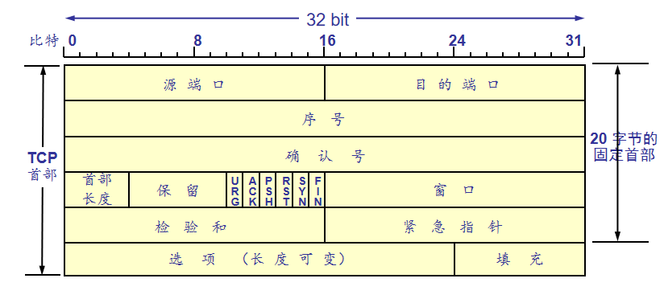
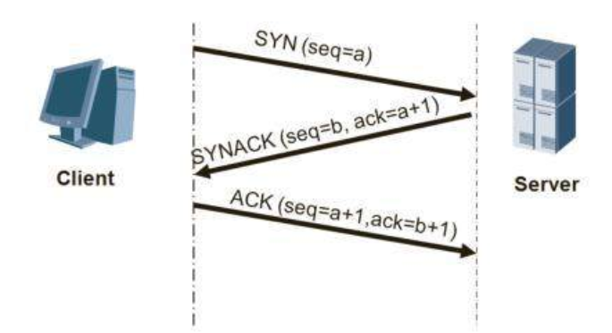
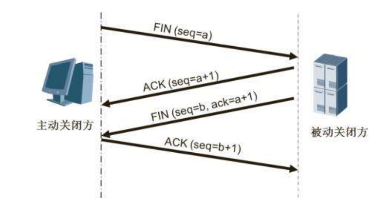

<!--
 * @Descripttion: 
 * @version: 
 * @Author: WangQing
 * @email: 2749374330@qq.com
 * @Date: 2019-12-03 18:41:45
 * @LastEditors: WangQing
 * @LastEditTime: 2019-12-03 20:15:35
 -->
# 面向传输的运输：TCP

## 概述

- 面向连接
    - TCP连接仅存在于端系统，中间路由器对此毫不知情
- 全双工服务
    - 可双向同时传输数据
- 点对点连接
    - 仅存在于两个端系统之间，无第三者插足
- 三次握手
    - 建立连接，协商参数
- 可靠的字节流
    - 最大报文段长MSS

## TCP报文段



- 源端口和目的端口字段——各占 2 字节。端口是运输层与应用层的服务接口。运输层的复用和分用功能都要通过端口才能实现。  
- 序号字段——占 4 字节。TCP 连接中传送的数据流中的每一个字节都编上一个序号。序号字段的值则指的是本报文段所发送的数据的第一个字节在整个报文字节流中的序号。 
    - TCP把数据看成是无结构但有序的字节流
    - 字节流中的每个字节编上序号
    - 报文段序号=该报文段首字节的字节流编号
- 确认号字段——占 4 字节，是期望收到对方的下一个报文段的数据的第一个字节的序号。
- 首部长度——占 4 bit，它指示意32bit为单位的TCP首部长度。
- 保留字段——占 6 bit，保留为今后使用，但目前应置为 0。
- 紧急比特 URG —— 当 URG = 1 时，表明紧急指针字段有效。它告诉系统此报文段中有紧急数据，应尽快传送。（一般不使用）
- 确认比特 ACK —— 只有当 ACK = 1 时确认号字段才有效。当 ACK = 0 时，确认号无效。
- 推送比特 PSH (PuSH) —— 接收 TCP 收到推送比特置 1 的报文段，就尽快地交付给接收应用进程，而不再等到整个缓存都填满了后再向上交付。  
- 复位比特 RST (ReSeT) —— 当 RST = 1 时，表明 TCP 连接中出现严重差错（如由于主机崩溃或其他原因），必须释放连接，然后再重新建立运输连接。
- 同步比特 SYN —— 同步比特 SYN 置为 1，就表示这是一个连接请求或连接接受报文。 
- 终止比特 FIN (FINal) —— 用来释放一个连接。当FIN = 1 时，表明此报文段的发送端的数据已发送完毕，并要求释放运输连接。 
- 窗口字段 —— 占 2 字节。窗口字段用来控制对方发送的数据量，单位为字节。TCP 连接的一端根据设置的缓存空间大小确定自己的接收窗口大小，然后通知对方以确定对方的发送窗口的上限。
- 检验和 —— 占 2 字节。检验和字段检验的范围包括首部和数据这两部分。在计算检验和时，要在 TCP 报文段的前面加上 12 字节的伪首部。
- 紧急指针字段 —— 占 16 bit。紧急指针指出在本报文段中的紧急数据的最后一个字节的序号。  
- 选项字段 —— 长度可变。TCP 只规定了一种选项，即最大报文段长度 MSS (Maximum Segment Size)。MSS 告诉对方 TCP：“我的缓存所能接收的报文段的数据字段的最大长度是 MSS 个字节。”
- 填充字段 —— 这是为了使整个首部长度是 4 字节的整数倍。 

## TCP超时的设置

- 如何设置TCP的超时
    - 应该大于RTT
        - 但RTT是变化的
    - 太短
        - 造成不必要的重传
    - 太长
        - 对丢包反应太慢

- 估算RTT
    - ```EstimatedRTT <= (1-α)*EstimatedRTT + α*SimpleRTT```
    - ```α=0.125```

- 计算偏差
    - ```DevRTT <= (1-β)*DevRTT+β*|SampleRTT-EstimatedRTT|```
    - ```β=0.25```

- 计算超时间间隔
    - ```TimeoutInterval = Estimated + 4*DevRTT```

## 可靠的TCP数据传输

- IP协议是不可靠的
- TCP采用数据可靠传输的方法
- 特殊
    - TCP编号采用按字节编号，而非按报文段编号
    - TCP仅采用唯一的超时定时器

## 超时间隔加倍

- 每一次TCP超时重传均将下一次超时间隔设为先前值的两倍
- 超时间隔由EstimatedRTT和DevRTT决定，每当发生下列事件之一是重新计算超时间隔
    - 收到上层应用的数据
    - 收到对未确认数据的ACK

# 快速重传

- 超时周期往往太长
    - 增加重发丢失分组的时延
- 通过重复的ACK检测丢失的报文段
    - 发送方常要连续发送大量报文段
    - 如果一个报文段丢失，会引起很多来连续的重复ACK
- 如果发送收到一个数据的3个重复ACK，它会认为确认数据之后的报文段丢失
    - **快速重传**: 在超时到来之前重传报文段

## 重传机制

- TCP积累是确认式的，只用一个定时器，很像GBN
- 但有区别：
    - 很多TCP实现缓存失序的报文段。
    - GBN在报文段n超时时，会重发从n开始所有未确认的报文段。而TCP只会重传报文段n。甚至如果在报文段n超时前收到了对报文段n+1的确认，TCP连报文段n都不会重传。
    - TCP还有快速重传机制。

## 流量控制

- 背景
    - TCP接收方有一个缓存，所有上交的数据都缓存在里面
    - 应用进程从缓冲区中读取数据可能很慢

- 目标
    - 发送方不会由于传的太多太快而使得接收方缓存溢出

- 手段
    - 接收方在反馈时，将缓冲区剩余空间的大小填充在报文段首部的窗口字段中，通知发送方

- TCP连接如何使用RcvWindow进行流量控制？
    - 接受方：把当前的RcvWindow值放入它发给发送方的报文段的窗口字段中以通知发送方自己在该连接的缓冲还有多少空间
    - 发送方：
        - LastByteSend：发送主机上发送的最后一个字节序号
        - LastByteAcked：发送主机上被确认的最后一个字节序号
    - ```LastByteSent – LastByteAcked ≤ RcvWindow```

- 一种特殊案例
    - 接收方通知发送方RcvWindow为0，且接收方无任何数据传送给发送方
    - 当接受方的缓冲区被应用进程清空后，接收方没有办法主动发送报文段通知发送方（假设接受方没有数据要发送，而发送方因为得知接收方传递接受窗口为0而被阻塞）
    - 解决办法：当接收端的接收窗口为0时，发送方持续向接受方发送只有一个字节数据的报文段，目的是试探

## TCP连接管理

- 三次握手

- 四次挥手
