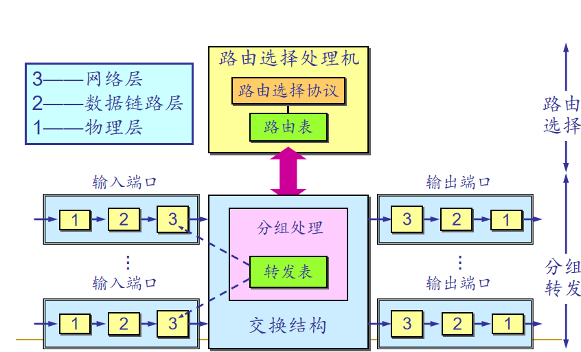
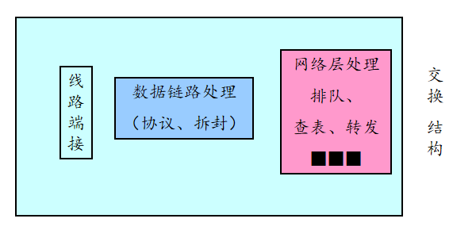
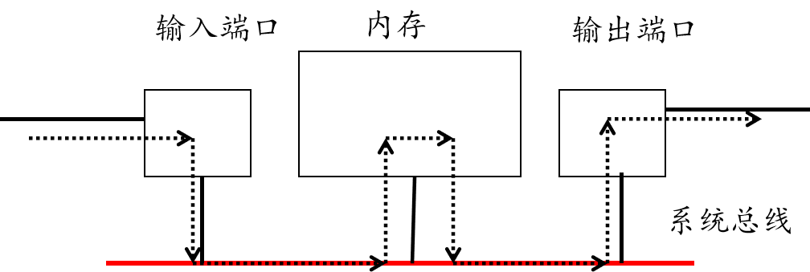
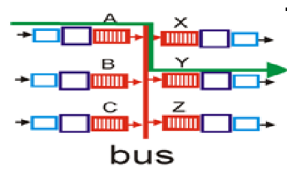
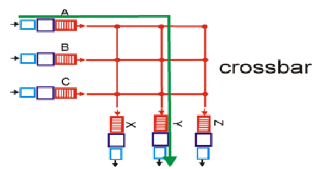
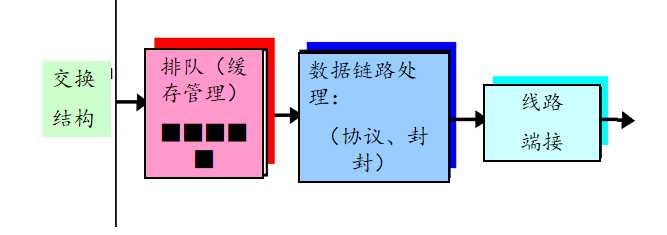

<!--
 * @Descripttion: 
 * @version: 
 * @Author: WangQing
 * @email: 2749374330@qq.com
 * @Date: 2019-12-04 13:51:38
 * @LastEditors: WangQing
 * @LastEditTime: 2019-12-04 14:34:15
 -->
# 路由器的工作原理

## 路由器的结构

## 输入端口

### 输入端口排队

- 如果输入端口的处理速率超过了交换结构的速率，输入端口就可能产生排队
- **线头阻塞**：在输入队列中排队的分组必须等待通过交换结构发送，因为它被位于线头的另一个分组阻塞了。即使该分组要转发的输出端口是空闲的
- **输入缓冲区溢出可导致排队时延和丢包!**

## 交换结构

### 经内存交换

- 在输入端口和输出端口之间的交换是在CPU（路由处理器）的直接控制下完成的
- 分组被拷贝到系统内存中，然后在CPU的控制下输送到输出端口
- 转发速度受限于内存的带宽（每个分组走两次总线） （内存带宽/2）

### 经总线交换

- 输入端口经一根共享总线将分组直接传送到输出端口
- 总线交换的问题: 交换速度受限于总线的带宽
- 现在，总线带宽超过1 Gbps 
- 对于运行在接入网或企业网的路由器，通过总线交换的转发速度是足够的。(区域网和主干网则不行)
- Cisco 5600：通过一个32Gbps的背板总线来交换分组

### 经内联网络

- 克服总线带宽限制
- 由2n条总线组成，将n个输入端口和n个输出端口连接
- 设计先进：将长度变化的IP分组分片成固定尺寸的信元，通过交换结构对信元进行转发 
- Cisco 12000: 通过内联网络交换速度为60Gb/s

## 输出端口

- 缓存管理：当交换结构将分组交付给输出端口的速率超过输出链路速率时
- 调度原则：在数据报队列中选择数据报进行传输

### 输出端口排队

- 当通过交换结构到达的分组速率超过了输出链路的速率时，需要对分组进行缓存
- **输出端口缓冲区溢出会导致分组的排队和丢失!**

## 输出端口分组调度策略

- 先来先服务FCFS
- 加权公平排队WFQ
- 分组调度程序在提供服务质量保证方面起着关键作用

## 分组丢弃策略

- 被动队列管理
    - 弃尾策略
    - 删除一个或者多个已排队分组
- 主动队列管理——随机早期检测RED
    - 随时计算平均队列长度avgth
    - 最小阈值minth、最大阈值maxth
    - avgth小于minth ，允许分组入列
    - avgth大于maxth ，分组被标记或丢弃
    - avgth在minth和maxth之间，按照概率标记或丢弃分组
