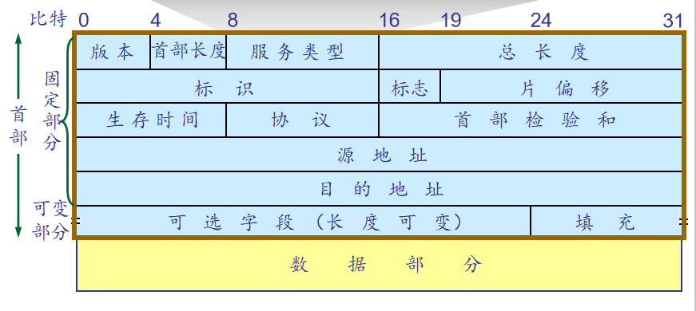
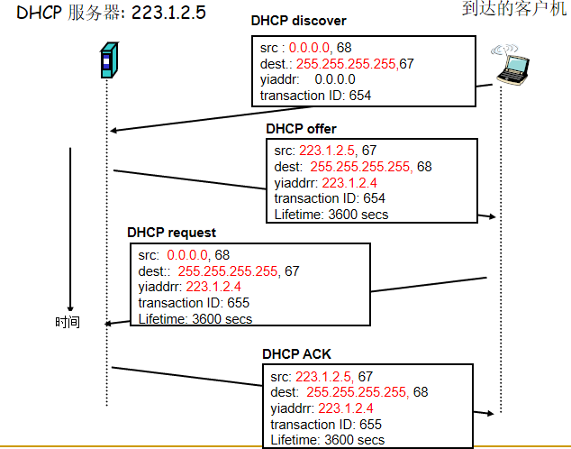
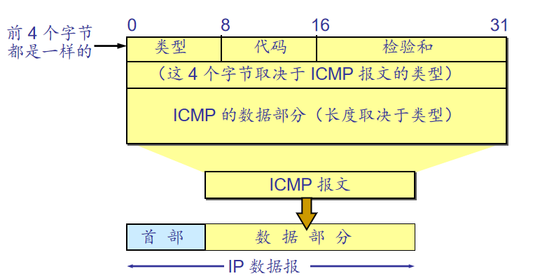
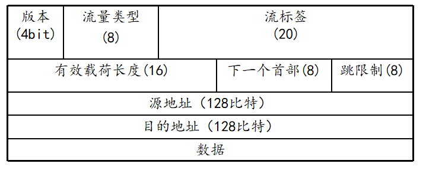

<!--
 * @Descripttion: 
 * @version: 
 * @Author: WangQing
 * @email: 2749374330@qq.com
 * @Date: 2019-12-04 14:51:47
 * @LastEditors: WangQing
 * @LastEditTime: 2019-12-04 16:47:36
 -->
# 网际协议:因特网中的转发和编址

## IP数据报格式

一个IP数据报由首部和数据两个部分组成。首部的前一部长度是20字节，后一部分为可变长度

- 版本：4bit，指IP协议的版本。通信双方使用的版本必须保持一致，目前使用的是IPV4。
- 首部长度：4bit。**以4字节为一个单位**。
- 服务类型：8bit，用来获取更好的服务。前3bit表示优先级，第4bit表示要求更低时延，第5比特表示要求更高吞吐量，第6比特表示要求更高可靠性，第7比特表示要求选择费用更低廉的路由，第8比特未用。 
- 数据报长度：指首部和数据之和的长度，单位为字节。
- 标识：是为了使分片后的各数据报片最后能准确地重装
- 标志：3bit，前2bit有意义。
    - 最低位为MF，MF=1即表示后面还有分片的数据报，MF=0表示这已是若干数据报片的最后一个。
    - 第二位记为DF，当DF=0时才允许分片
- 片偏移：13bit, 较长的分组在分片后，某个片在原分组中的相对位置。以8字节为单位。
- 寿命：记为TTL（Time To Live），又称生存时间。每当数据报经过一台路由器，该字段值减1。该值为0时被丢弃。
- 协议：8bit，协议字段指出此数据报携带的运输层数据是使用何种协议，以便目的主机的IP层知道应将数据部分上交给哪个处理过程。（如6表示TCP、17表示UDP）
- 首部校验和：此字段只检验数据报首部而不包括数据部分以减少工作量。和运输层（TCP、UDP）一起进行重复校验的原因：校验的内容不同；可能不属于同一个协议栈。
- 源地址和目的地址：各占4个字节。
- 可变部分：就是一个选项字段，用来支持排错、测量及安全等措施。但由于给服务器的处理带来麻烦，因此一般不使用

## IP分片和重组

- 网络链路具有 MTU (最大传输单位)属性——是由链路层最大帧的限制决定的
    - 不同类型的链路有不同的MTU值 
- 大的IP数据报在网络中会被分成小的分片
    - 一个数据报变成了几个数据报
    - 重组只在目的主机进行
    - 数据报头部的标识、标志以及片偏移字段用于目的主机对接收的分片进行重组

## IP地址

- 32位主机或路由器的接口标识符
- 接口：连接主机，路由器之间的物理链路
    - 一般来说，路由器有多个接口
    - 主机也可能有多个接口
- IP地址之和接口有关，而与主机，路由器却没有太多关联

- 在同一个局域网上的主机或路由器的。IP 地址中的网络号必须是一样的。
- 路由器总是具有两个或两个以上的 IP 地址。路由器的每一个接口都有一个不同网络号的 IP 地址。

## 子网的划分

**从主机号中借用一部分位数作为子网号**

## 子网掩码

- 获得方法
    - 通过将网络号和子网号相应的位置全置1，主机号相应的位置全置0，即可得到子网掩码
- 作用
    - 对外隐藏子网的存在，对内指示网络号和子网号的位置

## 无类别域间路由选择CIDR

- 背景
    - 地址空间的利用率低, 地址空间面临耗尽
- CIDR编址格式
    - IP地址 ::= {<网络前缀>, <主机号>} 
    - 地址的网络部分长度任意
    - 地址格式: a.b.c.d/x, 这里的 x表示地址中网络部分的位数 #
    - 斜线记法：192.168.0.1/24
    - 简写记法：10.0.0.0/10 => 10/10

- 使用单个网络前缀通告多个网络的能力称为路由聚合

## DHCP: 动态主机配置协议

- 目标：允许主机加入网络时动态地从网络服务器处获取IP地址

- DHCP协议并不仅仅只能获取IP地址
    - 网关地址
    - DNS地址
    - 子网掩码

## 网络地址转换NAT

- 动机: 本地网络只要使用一个IP地址就可以和外部网络相连 :
    - 不需要从 ISP处获得大批IP地址: 所有设备可以使用同一个 IP地址
    - 可以在不通知外部网络的情况下改变内网主机的IP地址
    - 即使改变了ISP也无须改变内网主机的IP地址
    - 内网主机对外网主机而言是不可见的、不可寻址的。(这也算是一项安全措施).

- 实现
    - **发送数据报**: 将每个外出报文的**源IP地址、端口号**替换为**NAT IP地址以及新的端口号**,远程客户机/服务器将以NAT IP 地址以及新的端口号做为目的地址进行响应.
    - 记住每一个地址转换对 (在 NAT 转换表中) ，即**源IP地址,端口号 -> NAT IP 地址,新的端口**
    - **接收数据报**:根据**NAT转换表将每个进入报文的NAT IP地址**,端口号替换为相应的源IP地址以及端口号

- 争议
    - NAT使用中的争议
    - 端口号是用于进程编址的，而不是用于主机编址的
    - 路由器仅应当处理高达第三层的分组
    - NAT协议违反了端到端原则，即主机彼此应相互直接对话，节点不应介入修改IP地址和端口号
    - 应使用IPv6来解决IP地址短缺问题

## ICMP：因特网控制报文协议

- 用于主机、路由器、网关之间交换网络层信息
    - 错误报告: 如主机、网络、端口、协议不可达等。
    - 回声请求/回答 (用于ping应用程序)
- 从体系结构而言，位于IP层之上 :
    - ICMP 报文封装在IP分组中
- ICMP 消息: 包括一个类型字段和一个编码字段
- ICMP 报文的种类有两种，即 ICMP 差错报告报文和 ICMP 询问报文

## IPv6

- 版本：IP协议版本号
- 流量类型：与IPv4的TOS相似
- 流标签：给属于特殊流（flow）的分组加上标签。
    - 特殊流指需要特别服务质量的数据流（如实时视频）。
    - 流量类型+流标签用于实现QoS
- 有效载荷长度：给出首部后面数据的字节数量。
- 下一个首部：标识该数据包中内容（数据字段）需要交付给哪个上层协议（如TCP或UDP）。
- 跳限制：转发数据报的每台路由器将该字段内容减一。当跳限制计数到0时，该数据报将被丢弃。同IPV4的TTL

## IPv4->IPv6

- 设立标志日，统一迁移
- 双栈技术
    - 新加入的设备支持IPv4/IPv6双协议栈
    - 一段链路上，如果源和目标均支持IPv6，则使用IPv6进行通信
    - 如果任一方不支持IPv6，则使用IPv4进行通信
    - 可能会出现信息的丢失
