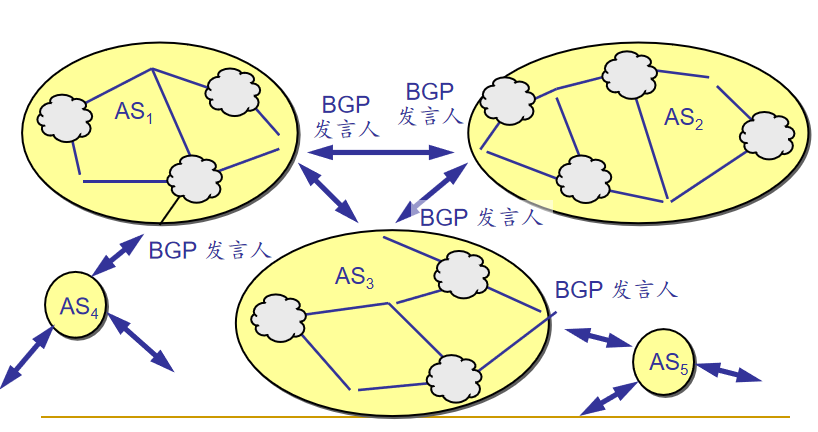
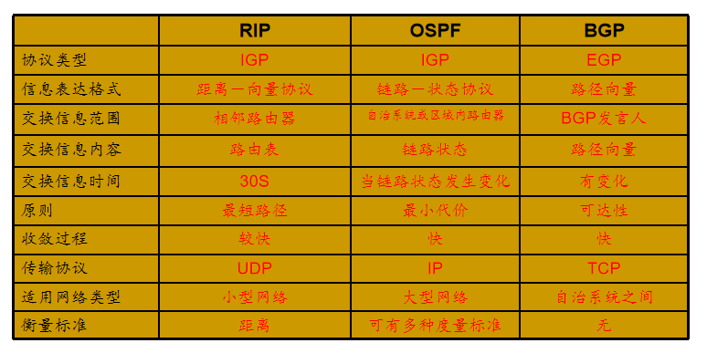

# 选路算法

- 默认路由器：一台主机**直接**连接到的路由器
- 源路由器：源主机的默认路由器
- 目的路由器：目的主机的默认路由器

## 选路算法的目的

- 给定一组路由器以及连接路由器的链路，从中找到一条从源路由器到目的路由器**好的**路径
    - 好的通常值费用最低的路径
    - 例外：A和B之间的路径费用很低，但是由于处于两个组织之间，而这两个组织做出的路由策略，不允许通行

## 选路算法分类

### 信息的全局性

- 全局选路算法
    - 所有路由器都知道整个网络拓扑图以及链路的费用信息
    - 链路状态算法
- 分散式选路算法
    - 每个路由器仅有与其相连的链路的费用信息
    - 通过迭代计算过程与相邻节点交换信息
    - 距离定量算法

### 信息为动态还是静态

- 静态选路算法
    - 随着时间的流逝，路由的变化非常缓
- 动态选路算法
    - 路由信息可以更快地发生变化
    - 周期性的更新
    - 可以响应拓扑或链路费用的变化

### 是否负载敏感

- 负载敏感算法
    - 链路费用会动态地变化以反应链路的当前状况
- 负载迟钝算法
    - 链路费用不明显地反应链路的当前状况

## 链路状态选路算法 LS

**Dijkstr(迪克斯特拉)算法**

- 所有的节点都知道网络拓扑和链路费用
    - 通过链路状态广播获得信息
    - 所有节点具有该网络的同一个完整的视图
- 计算从某节点到网络中所有其他节点的最低费用
    - 为该节点提供**转发表**

- 算法复杂度O(nlog(n))

- 利用链路状态算法可能产生震荡
- 解决方案
    - 强制链路费用不依赖于所承载的流量
        - 无法解决高拥塞问题，不可接收
    - 确保所有的路由器不同时运行LS算法
        - 因特网上的路由器能够自同步
        - 随机化路由器发送链路通告的时间

## 因特网中的链路状态选路--OSPF协议

- 开放：不是受某一家厂商控制，而是公开发表的
- 最短路径优先：使用了Sijkstr算法
- 是分布式的**链路状态协议**
- 特点
    - 不强制如何设置链路权值的策略，但提供对给定链路权值集合确定最低费用路径的机制
    - 即使链路状态未发生变化，每30分钟广播一次链路状态
    - 链路状态以OSPF通告的形式封装在OSPF报文中，由IP分组承载（协议号：89）
    - OSPF路由器之间的交换都是经过鉴别的（简单的、MD5的），以确认OSPF通告的真实性，防止伪造和篡改
    - OSPF通告都是有序列号的，以防止重放攻击
    - OSPF中支持多条具有相同费用的路径
    - OSPF支持多播选路和层次路由
    - OSPF使用IP数据报传输报文，是一个网络层协议

## 距离向量选路算法 DS

- 特点
    - 迭代，分布，自我终止，异步
- 思想
    - x到y的最低费用 = （x的邻居到y的最低费用 + x到邻居的距离）的最小值
    - 每个路由器中都有一张路由表
        - 目的网络号
        - 经过的邻居路由器
        - 到目的网络的距离
    - 路由器定期向其邻居路由器传送路由表的拷贝

## LS *vs* DS

||LS|DS
|--|--|--|
|报文的复杂性|n个节点，E条链路，需要发送O(nE)个报文|只在直连的邻居之间交换报文
|收敛速度|是一个要求O(nE)个报文的O(n^2)算法|收敛时间不确定；
|健壮性|节点能够向其连接的链路广播不正常计费；每个节点只计算自己的转发表，路由计算在某种程度上是分离的，有一定的健壮性|一个节点可向邻居节点告知其不正确的最低费用路径；每个节点的计算都会传递给它的邻居

## 因特网上的距离向量算法--RIP协议

- 相邻两点间链路上的费用定义为1，即只考虑源到目标经过多少个路由器，或多少“跳”
- 一条路径的最大费用限制为15
- 选路更新消息每30s在邻居之间以**RIP响应报文-RIP通告**的形式进行交换
- 路由器经过180s没有收到来自某个邻居的RIP通告，则认为该邻居已离线，修改选路表，向其它邻居广播
- **RIP是一个运行在UDP上的应用层协议（端口520）**

## 层次路由

- 背景
    - 因特网规模过大——数亿个目标网络
    - 管理自治
- 解决方案
    - 将路由器聚合到一个区域，**自治系统AS**
    - 在相同AS内的路由器看全部运行同样的选路算法
        - 自治系统内部选路协议IGP
    - 不同AS之间的选路
        - 边界网关协议BGP

## 因特网上的AS内层次路由——层次OSPF

- 为了使OSPF能够用于规模很大的网络，OSPF将一个自治系统再划分为若干更小的范围，叫做**区域**
- 每一个区域都有一个32bit的区域标识符
- 区域不能太大，在一个区域内的路由器最好不超过200个

## 因特网上的AS间路由——BGP4

- 因特网规模太大，使得自治系统之间路由选择非常困难
- BFP为每个AS提供一种手段，以处理
    - 从相邻AS获取子网可达性信息
    - 向该AS内部的所有路由器传播这些可达性信息
    - 基于该可达性信息的AS策略，决定到达子网的好路由（并非最佳）

### BGP发言人

- 每个自治系统的管理员要选择至少一个路由器作为该自治系统的**BGP发言人**
- 一般来说，两个BGP发言人都是通过一个共享网络连接在一起的，而BGP发言人往往就是BGP边缘路由器

### BGP交换路由信息

- 一个 BGP 发言人与其他自治系统中的 BGP 发言人要交换路由信息，就要先建立 TCP 连接，然后在此连接上交换 BGP 报文以建立 BGP 会话(session)，利用 BGP 会话交换路由信息。
- 使用 TCP 连接能提供可靠的服务，也简化了路由选择协议。
- 使用 TCP 连接交换路由信息的两个 BGP 发言人，彼此成为对方的邻站或对等站。

### 表项进入路由器转发表

- 路由器要知道前缀的存在
    - 通过BGP通告得知
- 路由器要确定适当的输出端口
    - 使用BGP路由选择最佳域名间路由
    - 使用IGP路由选择确定最佳域内路由
    - 确定最佳路由的转发端口
- 路由器将“前缀-端口”放入转发表

## RIP*vs*OSPF*vs*BGP
