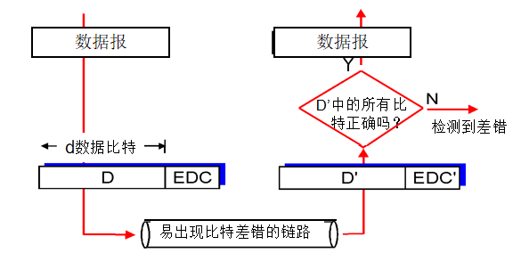
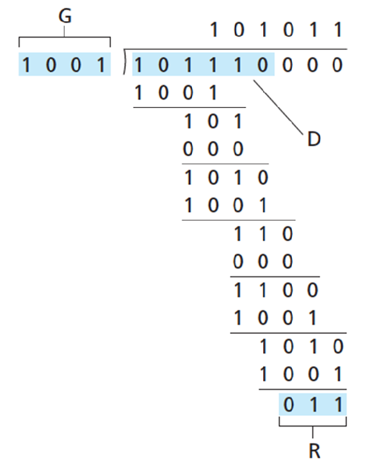

<!--
 * @Descripttion: 
 * @version: 
 * @Author: WangQing
 * @email: 2749374330@qq.com
 * @Date: 2019-12-05 14:19:46
 * @LastEditors: WangQing
 * @LastEditTime: 2019-12-05 14:37:23
 -->
# 差错检测和纠正技术

## 差错检测模型

- EDC 差错检测和纠错比特
- D 差错检测位保护的数据，可包括首部

## 奇偶校验

- 单比特奇偶校验
- 二维奇偶校验

## 检测和方法

- 发送方
    - 将数据段的内容作为16比特的整数序列
    - 校验和: 累加求和，计算和的1的补码
    - 发送方将得到的校验和值放入PDU校验和字段
- 接收方
    - 计算收到的数据段的校验和
    - 检查计算出的校验和与校验和字段中的值是否相同:
        - NO – 检测到错误
        - YES – 没有错误

## 循环冗余校验和

- d比特的数据，D
- 选择r＋1比特模式(生成多项式)，表示为G
- 目标：选择r个CRC比特，R，以便
    - <D,R>恰好能被G整除（模2计算）
    - 接收方已知G，用G去除<D,R> ，若余数非0，则检测到错误
    - 能检测到所有少于r+1比特的错误
- 在实践中被广泛应用 （以太网、802.11 WiFi、ATM)

