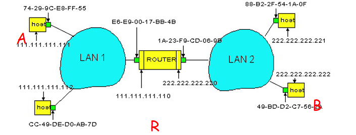

<!--
 * @Descripttion: 
 * @version: 
 * @Author: WangQing
 * @email: 2749374330@qq.com
 * @Date: 2019-12-05 16:38:27
 * @LastEditors: WangQing
 * @LastEditTime: 2019-12-05 16:58:45
 -->
# 链路层编址和ARP

## MAC地址

- 作用
    - 在数据链路标识每块网络适配器，使得能够在广播信道上寻址目标节点
- 组成
    - 48bit
    - 前24bit由IEEE分配管理
    - 后24bit由厂商自行分配

**局域网中每个适配器有唯一的MAC地址**

## 地址解析协议ARP

- 目标
    - 根据目标的IP地址获取其MAC地址
- ARP高速缓存
    - 局域网节点IP/MAC地址映射
- ARP协议
    - 工作在同一个子网ARP请求和应答被封装在帧里
    - 工作流程
        - 建立ARP请求包
        - 广播发送该ARP请求包
        - 目标IP接收到ARP请求包，建立包含自己MAC地址的ARP应答包
        - 直接向源IP发送该ARP应答包
        - 源IP更新ARP高速缓存

## 发送数据报到子网以外

- A创建IP数据报，源地址为A,目的地址为 B 
- A 用ARP获得 R中 111.111.111.110 对应的MAC地址(E6-E9-00-17-BB-4B)
- A创建链路层帧(封装A到B的IP数据报)，目的地址为R的MAC地址(E6-E9-00-17-BB-4B)
- A的适配器发送以太网帧
- R的适配器接收该以太网帧
- R从以太帧获取IP数据报，得知它的目的是到B(需要穿过子网2)
- R用ARP获得B的MAC地址
- R创建帧(封装A到B的IP数据报)，发送给B
