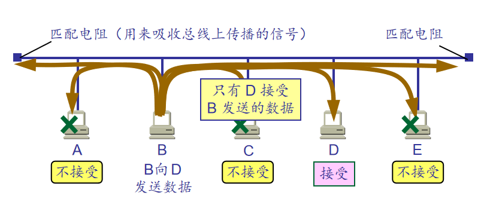
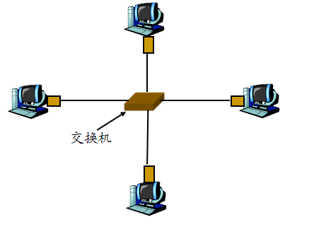
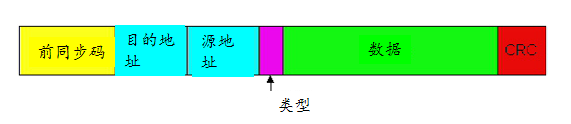

<!--
 * @Descripttion: 
 * @version: 
 * @Author: WangQing
 * @email: 2749374330@qq.com
 * @Date: 2019-12-05 16:59:23
 * @LastEditors: WangQing
 * @LastEditTime: 2019-12-05 17:13:40
 -->
# 局域网-以太网

## 以太网类型

- 共享式以太网（共享广播链路）

- 交换式以太网（完全由交换机组建，主机直接连到交换机，链路是点对点的）

## 争用期长度

- 以太网取 51.2 us 为争用期的长度。
- 对于 10 Mb/s 以太网，在争用期内可发送512 bit，即 64 字节。
- 以太网在发送数据时，若前 64 字节没有发生碰撞，则后续的数据就不会发生碰撞。

## 最短有效帧长

- **如果发生碰撞，就一定是在发送的前 64 字节之内。** 
- 由于一检测到碰撞就立即中止发送，这时已经发送出去的数据一定小于 64 字节。 
- 以太网规定了最短有效帧长为 64 字节，凡长度小于 64 字节的帧都是由于冲突而异常中止的无效帧。

## 以太网帧结构

- 数据字段:（46字节-1500字节）
- 前同步码: 
    - 总共8字节，前7 字节的格式为 10101010 ，最后一个字节格式为10101011
    - 用于同步发送方与接收方时钟
- 地址: 6 字节
    - 若适配器收到以太网帧，目的地址为自己的MAC地址或广播地址（如ARP包），就将帧中的数据传给网络层。
    - 否则，适配器丢弃该帧
- 类型: 2字节。上层协议类型 (大多为IP协议，也支持其它协议如Novell IPX 和AppleTalk)
- CRC: 4字节，由接收方检查,若检测到错误，就将该帧丢弃

## 以太网提供的服务

- 无连接服务: 在送适配器和接收适配器之间不需要握手
- 不可靠服务: 接收适配器不发送确认帧或否认帧给发送方

## 以太网使用的CSMA/CD

- 特点
    - 没有时隙
    - 当适配器侦听到其它适配器在传输，则它不传输帧, 即载波侦听
    - 正在传输的适配器若检测到其它适配器也在传输，则它中止自己的传输, 即碰撞检测
    - 在重新传输之前，适配器要等待一段随机时间，即随机回退
