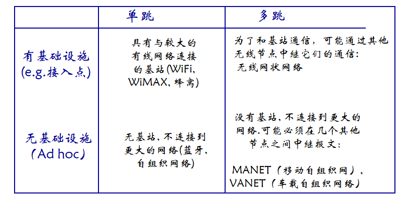

<!--
 * @Descripttion: 
 * @version: 
 * @Author: WangQing
 * @email: 2749374330@qq.com
 * @Date: 2019-12-06 14:46:55
 * @LastEditors: WangQing
 * @LastEditTime: 2019-12-06 15:13:28
 -->
# 概述

## 无线网络的元素

- 无线主机
    - 可以是便携机, PDA, IP 电话；
    - 能运行程序；
    - 本身既可能是固定，也可能是移动的.
- 无线链路
    - 典型的作用是用于连接无线主机和基站
    - 也可以用于骨干链路
    - 与链路访问相匹配的多址访问协议
    - 多种数据传输速率和传输距离
- 基站
    - 典型的作用是用于连接无线网络
    - 负责向其覆盖范围内的主机发送和接收分组，在无线网络和无线主机之间的链路层中起作用

## 无线网络分类

