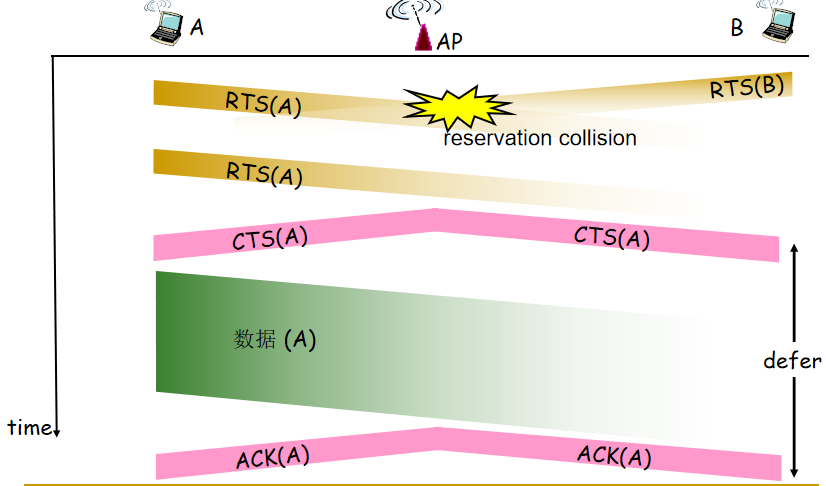
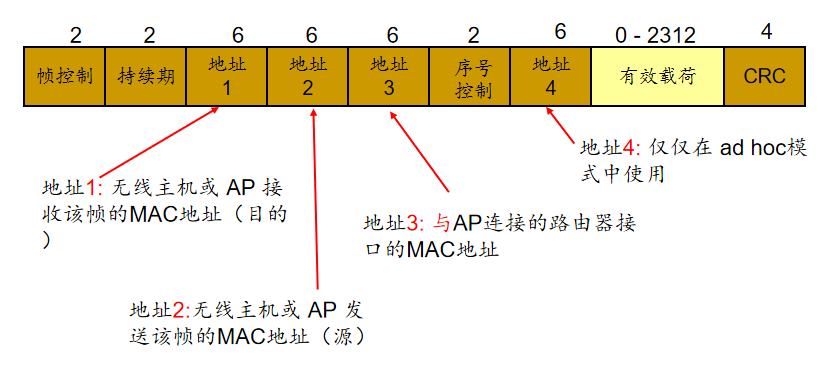
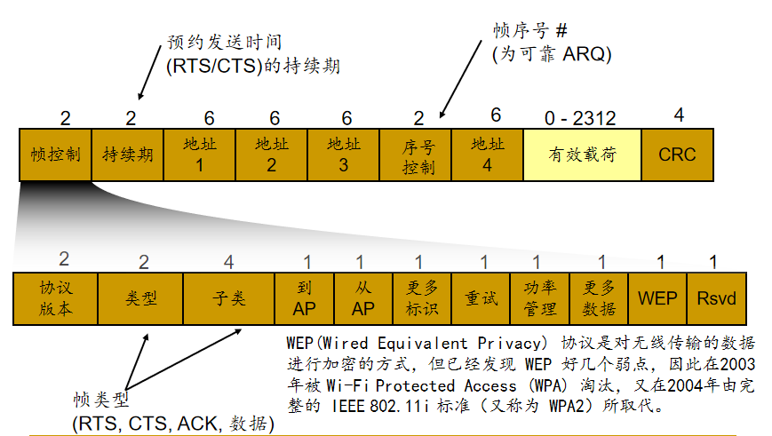

<!--
 * @Descripttion: 
 * @version: 
 * @Author: WangQing
 * @email: 2749374330@qq.com
 * @Date: 2019-12-06 15:39:10
 * @LastEditors: WangQing
 * @LastEditTime: 2019-12-06 16:02:53
 -->
# WiFi

## 802.11体系结构

- 无线终端通过基站（AP）进行通信
- 基本服务集BSS包括
    - 无线终端
    - 基站AP
    - Ad hoc模式下只有终端

### 基本构建模块——基本服务集BSS

- 一个基本服务集BSS包括一个基站和若干个移动站。
- 所有的站在本BSS以内都可以直接通信，但在和本BSS以外的站通信时都必须通过本BSS的基站。一个基本服务集BSS所覆盖的地理范围叫作一个基本服务区BSA。 
- 基本服务区BSA和无线移动通信的蜂窝小区相似。在无线局域网中，一个基本服务区BSA的范围可以有几十米的直径。
- 基本服务集里面的基站叫做接入点AP(Access  Point)，其作用和交换机相似。
- 一个基本服务集可以是孤立的，也可通过接入点AP连接到一个主干分配系统DS，然后再接入到另一个基本服务集，这样就构成了一个扩展服务集ESS。

## 802.11的MAC协议——CSMA/CA

- 发送方的工作流程（CSMA）
    - 如果侦听到信道闲置了DIFS 秒，则传输整个帧 (无冲突检测)
    - 如果侦听到信道忙，则选择一个随机避退值作为定时器的定时时间，并在侦听信道是否闲置时递减该值。
    - 定时时间一到且信道空闲就发送数据
    - 如果收到确认，且站点要继续发送数据，则执行第2步
    - 如果没有收到确认（ ACK）,则在更大范围内选取随机值, 重复第2步
- 接收方
    - 如果帧收到则OK，等待 SIFS秒后返回ACK (ACK是必须的) 

### 冲突避免（CA）

思路:  允许发送方“预约”信道而非随机访问 :避免长的数据帧冲突

- 发送方在发送数据帧之前首先使用 CSMA协议广播发送一个短的请求发送RTS( request-to-send)帧给AP
- AP广播一个允许发送  CTS（clear-to-send）帧响应 RTS
- RTS ，CTS被所有节点侦听到

## 802.11 帧格式

## 802.11高级特色

- 802.11速率自适应
    - 基站和移动终端之间的速度会随着移动终端的移动和SNR的变化而智能的调整
- 功率管理
    - node-to-AP: “我将保持睡眠状态直到下一个信标帧”（功率管理比特设为1）
        - AP 知道不应当向这个节点发送任何帧
        - AP缓存所有需要发送给该节点的帧
        - 节点在下一个信标帧前被唤醒（定时器）
    - 信标帧: 包含了帧被缓存在AP中的节点的列表
        - 如果有帧，被唤醒节点会保持活动状态，请求这些帧，再转入睡眠状态
        - 如果没有帧，重新进入睡眠状态直到下一个信标帧前
        - 没有帧要发送或接收的节点能睡眠99%的时间

## 802.15——无线个人区域网
- 半径小于 10 米
- 取代那些电缆 (鼠标, 键盘, 耳机)
- 是自组网: 无固定基础设施
- 主/从式:
    - 从设备 请求允许向主设备发送；
    - 主设备同意请求。
- 802.15: 从蓝牙技术规范演变而来
    - 2.4-2.5 GHz 无线电波段
    - 最大数据速率 721 kbps
