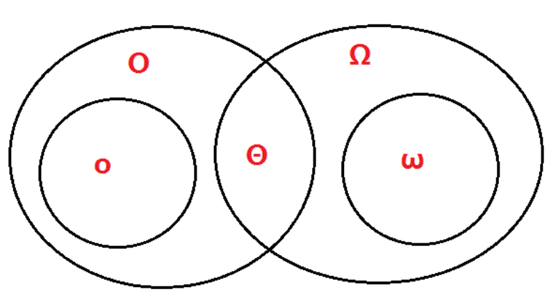

<!--
 * @Descripttion: 
 * @version: 
 * @Author: WangQing
 * @email: 2749374330@qq.com
 * @Date: 2020-01-02 18:36:01
 * @LastEditors  : WangQing
 * @LastEditTime : 2020-01-02 18:56:26
 -->
# 渐进符号

## Θ符号

Θ(g(n))={f(n):存在正常量c1,c2,n0,使得对所有的n>=n0,有0<=c1g(n)<=f(n)<=c2g(n)}

## O符号

O(g(n))={f(n):存在正常量c,n0,使得对所有的n>=n0,有0<=f(n)<=cg(n)}

## Ω符号

Ω(g(n))={f(n):存在正常量c,n0,使得对所有的n>=n0,有0<=cg(n)<=f(n)}

## o符号

o(g(n))={f(n):对任意的c>0,存在n0>0,使得对所有的n>=n0,有0<=f(n)<cg(n)}

## ω符号

ω(g(n))={f(n):对任意的c>0,存在n0>0,,使得对所有的n>=n0,有0<=cg(n)<f(n)}

## 关系

符号|含义|通俗理解|
:-:|:-:|:-:|
Θ|紧确界|相当于=|
O|上界|相当于<=|
o|非紧上界|相当于<|
Ω|下界|相当于>=|
ω|非紧下界|相当于>|

