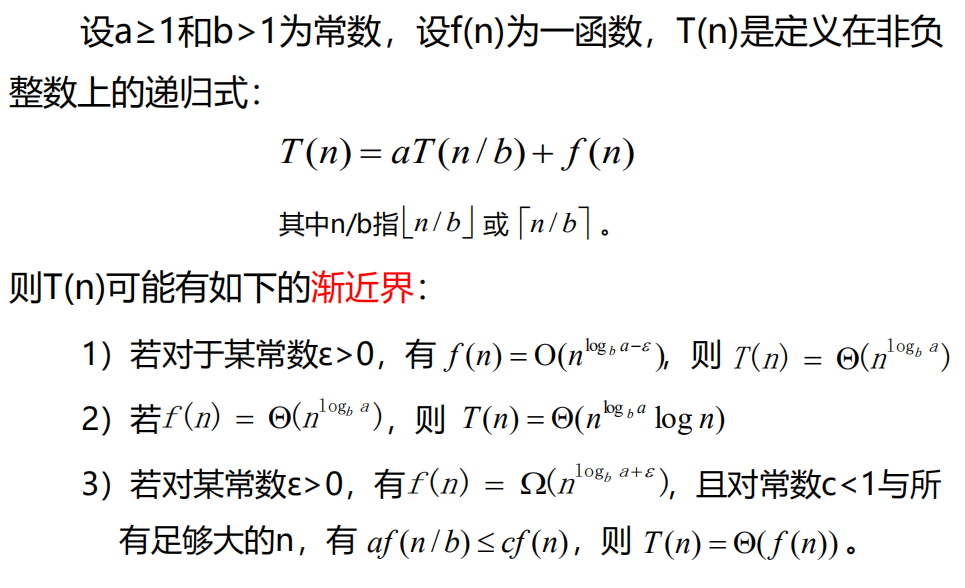

<!--
 * @Descripttion: 
 * @version: 
 * @Author: WangQing
 * @email: 2749374330@qq.com
 * @Date: 2020-01-02 19:28:37
 * @LastEditors: WangQing
 * @LastEditTime: 2020-01-02 19:39:58
 -->
# 求解递归式

- 分治的基本思想是递归策略
- 分治算法形式上是一个递归计算过程
- 分治算法的时间分析通常用递归关系式进行推导

## 代入法

- 猜测解的形式
- 用数学归纳法求出解中的常数，并证明正确性

## 递归树

- 构造递归树
- 逐层扩展递归树
- 计算每层代价
- 计算总代价

## 主定理

