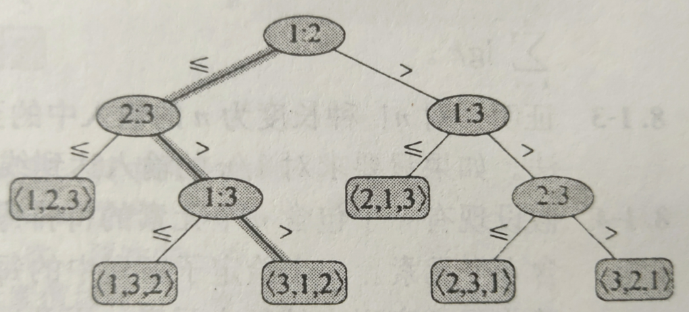

<!--
 * @Descripttion: 
 * @version: 
 * @Author: WangQing
 * @email: 2749374330@qq.com
 * @Date: 2020-01-03 17:17:27
 * @LastEditors  : WangQing
 * @LastEditTime : 2020-01-03 17:31:16
 -->
# 排序算法的下界

## 决策树模型

## 最坏情况的下界

**在最坏情况下，任何比较算法都需要做Ω(nlgn)次比较**