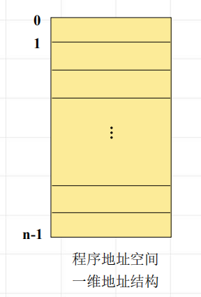
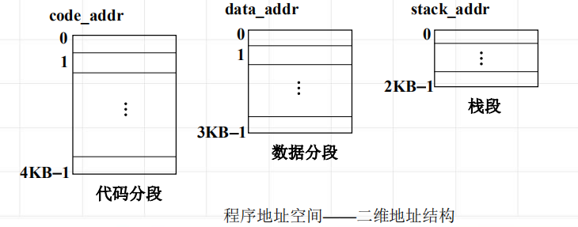

<!--
 * @Descripttion: 
 * @version: 
 * @Author: WangQing
 * @email: 2749374330@qq.com
 * @Date: 2020-01-04 21:06:43
 * @LastEditors  : WangQing
 * @LastEditTime : 2020-01-04 21:09:19
 -->
# 主存管理概述

## 主存共享方式——分片共享

- 大小不等的区域
    - 分区存储管理
    - 段式存储管理
- 大小相等的区域
    - 页式存储管理
- 二者结合
    - 段页式存储管理

## 程序的逻辑结构

