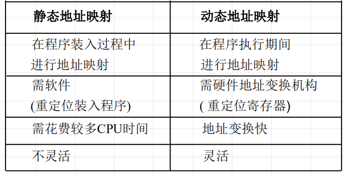
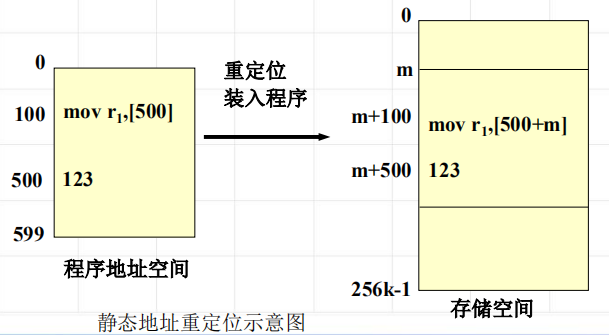
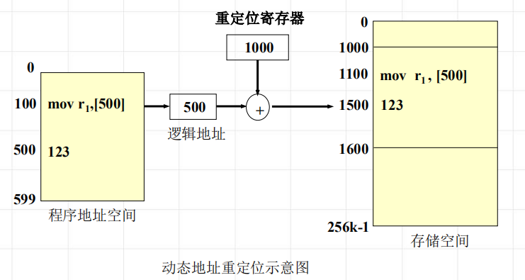
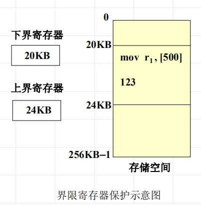
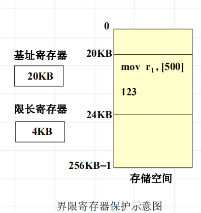

<!--
 * @Descripttion: 
 * @version: 
 * @Author: WangQing
 * @email: 2749374330@qq.com
 * @Date: 2020-01-04 21:09:30
 * @LastEditors: WangQing
 * @LastEditTime: 2020-01-04 21:18:46
 -->
# 主存管理的功能

## 地址映射

将程序地址空间中使用的逻辑地址变换成主存中的物理地址的过程，称为地址映射

## 主存分配

- 构造分配用的数据结构
- 制定策略
- 实施主存分配与回收

## 主存扩充

- 程序的全部代码和数据存放在辅存中；
- 将程序当前执行所涉及的那部分程序代码放入主存中；
- 程序执行时，当所需信息不在主存，由操作系统和硬件相配合来完成主存从辅存中调入信息，程序继续执行。

**虚拟存储器**

由操作系统和硬件相配合来完成主存和辅存之间的信息的动态调度。这样的计算机系统好像为用户提供了一个其存储容量比实际主存大得多的存储器，这个存储器称为虚拟存储器。

## 存储保护

在多用户环境中，主存储器按区分配给各用户程序使用。为了互不影响，必须由硬件 (软件配合)保证各用户程序只能在给定的存储区域内活动，这种措施叫做存储保护。
**上、下界防护**

**基址、限长防护**
