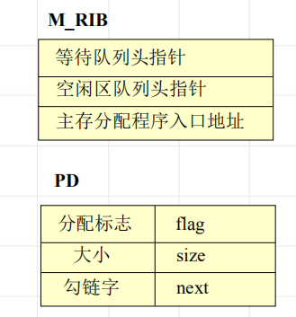

<!--
 * @Descripttion: 
 * @version: 
 * @Author: WangQing
 * @email: 2749374330@qq.com
 * @Date: 2020-01-04 21:18:55
 * @LastEditors: WangQing
 * @LastEditTime: 2020-01-04 21:35:12
 -->
# 分区存储管理

## 动态分区分配

在处理程序的过程中，建立分区，依用户请求的大小分配分区。

**主存资源信息块M_RIB**
**分区描述器PD**
**空闲区队列结构**

## 分区的分配与回收

**分区分配思路**
- 寻找空闲块
- 依申请者所要求的主存区的大小，分区分配程序在自由主存队列中找一个满足用户需要的空闲块；
- 若找到了所需的空闲区，有两种情况
    - 空闲区与要求的大小相等，将该空闲区分配并从队列中摘除；
    - 空闲区大于所要求的的大小，将空闲区分为两部分：一部分成为已分配区，建立已分配区的描述器；剩下部分仍为空闲区。返回所分配区域的首址；
- 否则，告之不能满足要求

**分区回收思路**
- 检查释放分区 (即为回收分区)在主存中的邻接情况若上、下邻接空闲区，则合并，成为一个连续的空闲区
- 若回收分区不与任何空闲区相邻接建立一个新的空闲区，并加入到空闲区队列中。

## 放置策略

选择空闲区的策略，称为放置策略

**首次适应算法**
- 什么是首次适应算法
    - 首次适应算法是将输入的程序放置到主存里第一个足够装入它的地址最低的空闲区中。
- 空闲区队列结构
    - 空闲区地址由低到高排序
- 首次适应算法的特点
    - 尽可能地利用存储器中低地址的空闲区，而尽量保存高地址的空闲区。

**最佳适应算法**
- 什么是最佳适应算法
    - 最佳适应算法是将输入的程序放置到主存中与它所需大小最接近的空闲区中。
- 空闲区队列结构
    - 空闲区大小由小到大排序
- 最佳适应算法的特点
    - 尽可能地利用存储器中小的空闲区，而尽量保存大的空闲区。

**最坏适应算法**
- 什么是最坏适应算法
    - 最坏适应算法是将输入的程序放置到主存中与它所需大小差距最大的空闲区中。
- 空闲区队列结构
    - 空闲区大小由大到小排序
- 最坏适应算法的特点
    - 尽可能地利用存储器中大的空闲区。

## 碎片问题及拼接技术

碎片问题是指在已分配区之间存在着的一些没有被充分利用的空闲区

所谓拼接技术是指移动存储器中某些已分配区中的信息，使本来分散的空闲区连成一个大的空闲区

