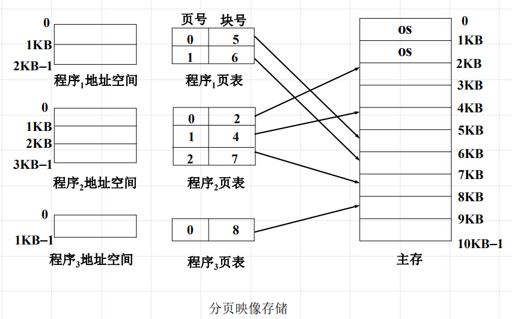

<!--
 * @Descripttion: 
 * @version: 
 * @Author: WangQing
 * @email: 2749374330@qq.com
 * @Date: 2020-01-04 21:35:34
 * @LastEditors: WangQing
 * @LastEditTime: 2020-01-04 21:53:23
 -->
# 页式存储管理

## 基本概念

- 页面
    - 程序的地址空间被等分成大小相等的片，称为页面，又称为虚页。
- 主存块
    - 主存被等分成大小相等的片，称为主存块，又称为实页。
- 页面与主存块的关系

- 页表
    - 为了实现从地址空间到物理主存的映象，系统建立的记录页与内存块之间对应关系的地址变换的机构称为页面映像表，简称页表

## 页式地址变换

CPU虚地址长度16位，页面大小为1KB时

## 请调页面的机制

**扩展页表**

- 中断位i ： 标识该页是否在主存若i=1，表示此页不在主存；若i=0，表示该页在主存
- 辅存地址 ：该页面在辅存的位置

## 淘汰机制与策略

用来选择淘汰哪一页的规则叫做置换策略，或称淘汰算法

- 引用位 —— 标识该页最近是否被访问
- 改变位 —— 表示该页是否被修改

**置换算法**
- 最佳算法（OPT算法）
    - 当要调入一新页而必须先淘汰一旧页时，所淘汰的那一页应是以后不再要用的，或者是在最长的时间以后才会用到的那页。
- 先进先出淘汰算法(FIFO算法)
    - 总是选择在主存中居留时间最长 (即最早进入主存)的一页淘汰。
- 最久未使用淘汰算法(LRU算法)
    - 总是选择最长时间未被使用的那一页淘汰。