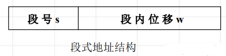
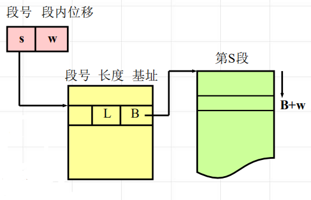
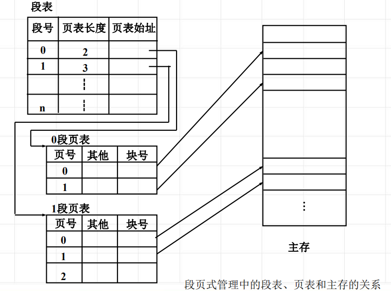

<!--
 * @Descripttion: 
 * @version: 
 * @Author: WangQing
 * @email: 2749374330@qq.com
 * @Date: 2020-01-04 21:53:54
 * @LastEditors: WangQing
 * @LastEditTime: 2020-01-04 21:57:37
 -->
# 段页式存储管理

分段是程序中自然划分的一组逻辑意义完整的信息集合。

## 段式地址变换

