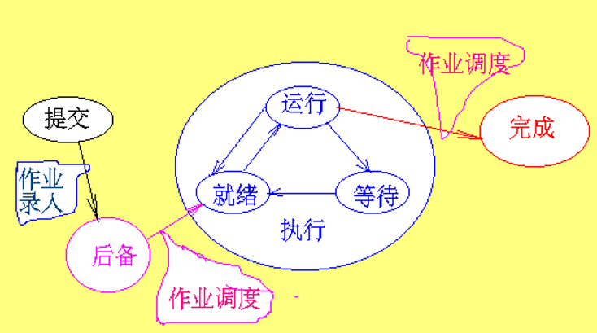
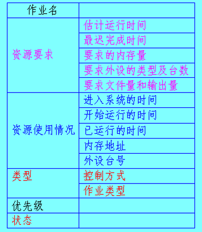

<!--
 * @Descripttion: 
 * @version: 
 * @Author: WangQing
 * @email: 2749374330@qq.com
 * @Date: 2020-01-03 20:24:19
 * @LastEditors  : WangQing
 * @LastEditTime : 2020-01-03 20:44:37
 -->
# 作业调度

用户要求处理的一项工作称为一个作业

作业调度的主要任务是完成作业从后备状态到执行状态和从执行状态到完成状态的转变。
**功能：**
1. 确定数据结构，记录已进入系统的各作业的情况（JCB，Job Control Block）；
2. 按一定的调度算法，从后备作业中选择一个或几个作业进入内存；
3. 分配资源，为被选中的作业创建进程，并为其申请系统资源；
4. 作业结束后作善后处理。

## 作业控制块

每个作业进入系统时由系统为其建立一个作业控制块JCB

## 性能分析

## 作业调度算法

**先来先服务调度算法（FCFS）**
- 先来先服务算法是按作业来到的先后次序进行调度的，换句话说，调度程序每次选择的作业是等待时间最久的，而不管作业的运行时间的长短。这种调度算法突出的优点是实现简单，效率较低，在一些实际的系统和一般应用程序中采用这种算法的较多。

**短作业优先调度算法（SJF）**
- 短作业优先调度算法考虑作业的运行时间，每次总是选择一个运行时间最小的作业调入内存（系统） 
- 在一般情况下这种调度算法比先来先服务调度算法的效率要高一些。实现相对先来先服务调度算法要困难些，如果作业的到来顺序及运行时间不合适，会出现饿死现象。

**响应比高者优先调度算法**

**优先数调度算法**