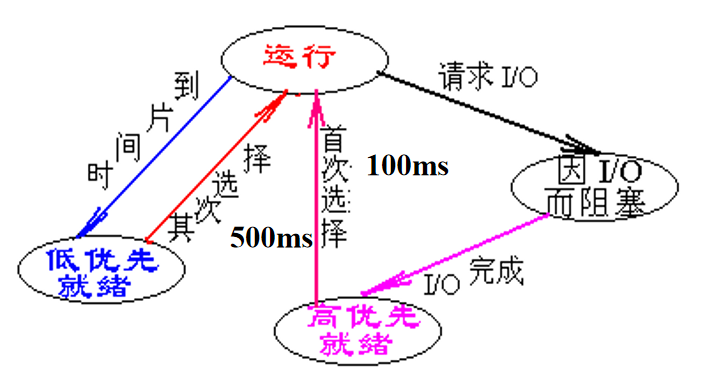

<!--
 * @Descripttion: 
 * @version: 
 * @Author: WangQing
 * @email: 2749374330@qq.com
 * @Date: 2020-01-03 20:44:44
 * @LastEditors  : WangQing
 * @LastEditTime : 2020-01-03 21:11:36
 -->
# 进程调度

进程的调度可分为**调度和分派**两个功能：
- 调度：组织和维护就绪进程队列。包括确定调度算法、按调度算法组织和维护就绪进程队列。
- 分派：是指当处理机空闲时，从就绪队列队首中移一个PCB，并将该进程投入运行。

**功能**：
1. 记录和保持系统中所有进程的有关情况和状态特征
    - 进程调度的信息记录在PCB中，包括进程的状态、调度优先级（优先数）、就绪进程队列等。
2. 决定分配（处理机）策略
    - 先来先服务
    - 优先数调度策略
    - 调度策略的不同，组织就绪进程队列的方式不同
3. 实施处理机的分配
    - 调度算法的选择（调度算法）
    - 调度时机的选择（调度时机）
    - 和调度方式相关
    - 实施进程调度（调度程序）

**调度方式**
1. 非剥夺方式
    - 进程已执行，若一个更为紧迫的进程来到，必须该进程执行完或时间片到，才让更紧迫的进程执行。
2. 可剥夺方式
    - 有更紧迫的进程到来，中止当前进程的执行，立即让更紧迫的进程执行。

**进程优先数调度算法**

- 静态优先数
    - 进程的优先数在进程创建时确定后就不再变化。
    - 系统确定（运行时间、使用资源，进程的类型）
    - 用户确定（紧迫程度，计费有关）
    - 系统与用户结合
- 动态进程优先数
    - 系统在运行的过程中，根据系统的设计目标，不断地调整进程的优先数，这种方法的优点是能比较客观地反映进程的实际情况和保证达到系统设计目标。

**循环轮转调度算法**

- 把系统的响应时间分成若干时间片
- 进程被调度到后，占用一个时间片
- 多个进程循环轮转占用CPU

**进程状态变迁图**
