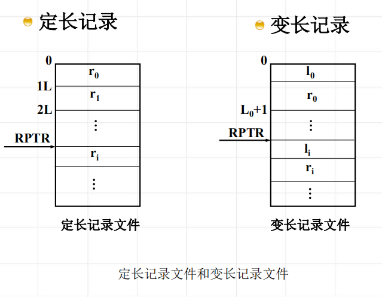

<!--
 * @Descripttion: 
 * @version: 
 * @Author: WangQing
 * @email: 2749374330@qq.com
 * @Date: 2020-01-05 17:48:19
 * @LastEditors  : WangQing
 * @LastEditTime : 2020-01-05 17:54:04
 -->
# 文件的逻辑结构与存取方法

## 文件的逻辑结构

- 流式文件
    - 流式文件是相关的有序字符的集合，是无结构的
    - 流式文件是按信息的个数或以特殊字符为界进行存取的
- 记录式文件
    - 记录式文件是一种有结构的文件。这种文件在逻辑上总是被看成一组连续顺序的记录的集合
    - 定长与变长文件
    

## 文件的存取方法

- 顺序存取
    - 后一次存取总是在前一次存取的基础上进行的
    - 顺序存取时不必给出具体的存取位置
- 随机存取
    - 用户以任意次序请求某个记录
    - 随机存取时要指出起始存储位置