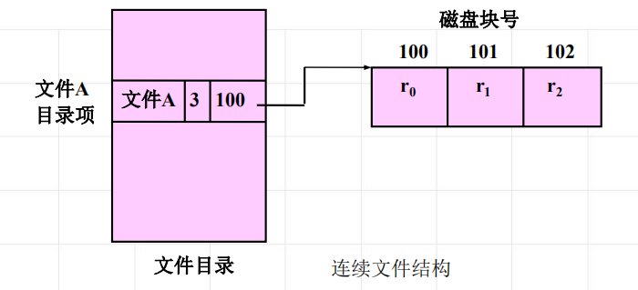
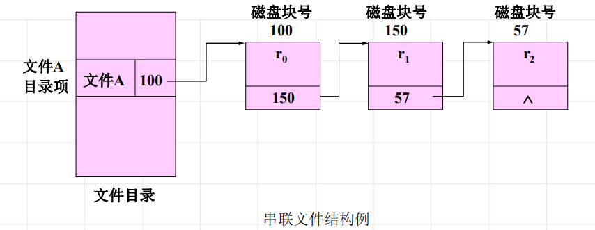
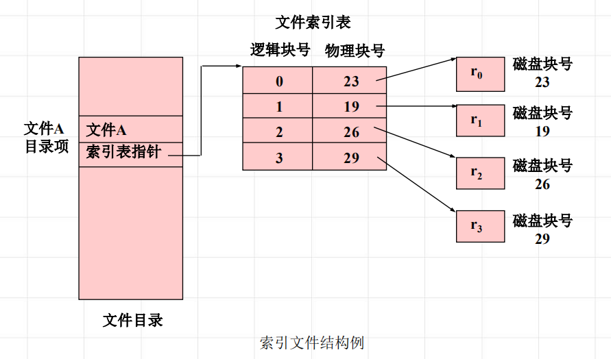
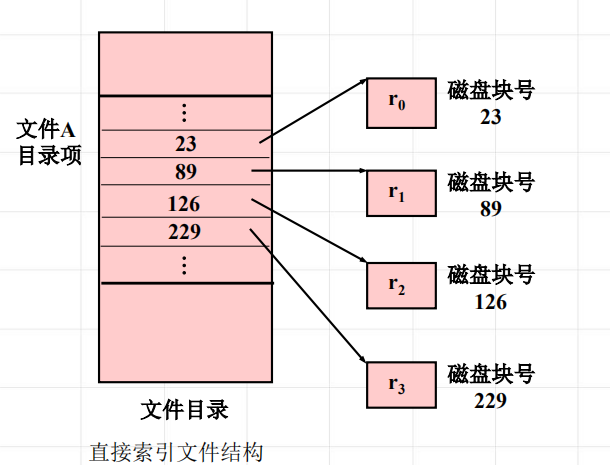
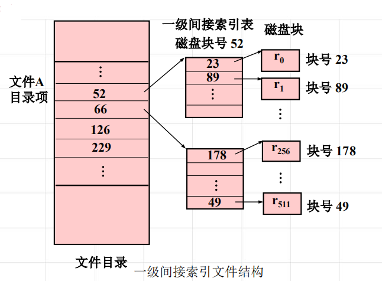
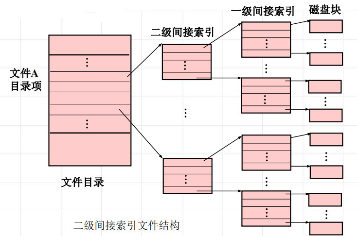

<!--
 * @Descripttion: 
 * @version: 
 * @Author: WangQing
 * @email: 2749374330@qq.com
 * @Date: 2020-01-05 17:54:19
 * @LastEditors: WangQing
 * @LastEditTime: 2020-01-05 18:01:44
 -->
# 文件的物理结构

## 连续文件

连续文件结构是由一组分配在磁盘连续区域的物理块组成的

**特点**
- 连续存储时速度较快
- 文件长度一经固定便不易改变
- 文件的增生和扩展不易

## 串联文件

串联文件结构是按顺序由串联的块组成的，即文件的信息存于若干块物理块中，每个物理块的最末一个字作为链接字，它指出后继块的物理地址。文件的最后一块的链接字为结束标记“^”，它表示文件至本块结束。

**特点**
- 能较好地利用辅存空间
- 易于对文件进行增生和扩充
- 连续存取时速度较快

## 索引文件

系统为每个文件建立逻辑块号与物理块号的对照表。这张表称为该文件的索引表。文件由数据文件和索引表构成。这种文件称为索引文件。

**特点**
- 易于文件的增删
- 直接读写任意记录

## 索引表的组织——多级索引

- 直接索引

- 一级间接索引

- 二级间接索引
