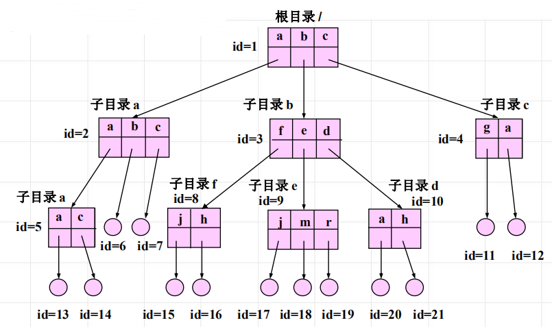

<!--
 * @Descripttion: 
 * @version: 
 * @Author: WangQing
 * @email: 2749374330@qq.com
 * @Date: 2020-01-05 18:01:57
 * @LastEditors: WangQing
 * @LastEditTime: 2020-01-05 18:07:56
 -->
# 文件目录及其结构

## 文件目录有关概念

- 文件目录项
    - 文件目录是记录文件的名字、存放地址及其他有关文件的说明信息和控制信息的数据结构

## 一级文件目录

系统将已建立的所有文件的文件名、存放地址及有关的说明信息放在一张表中，这张表称为一级文件目录

**特点**
- 实现了按名存取的功能，比较简单
- 要求文件名和文件之间有一一对应的关系，即：不允许两个文件有相同的名字

**重名问题**

## 树型文件目录

在多级目录系统中 (除最末一级外)，任何一级目录的目录项可以描述一个目录文件，也可以描述一个非目录文件 (数据文件)，而数据文件一定在树叶上。这样，就构成了一个树形层次结构。

