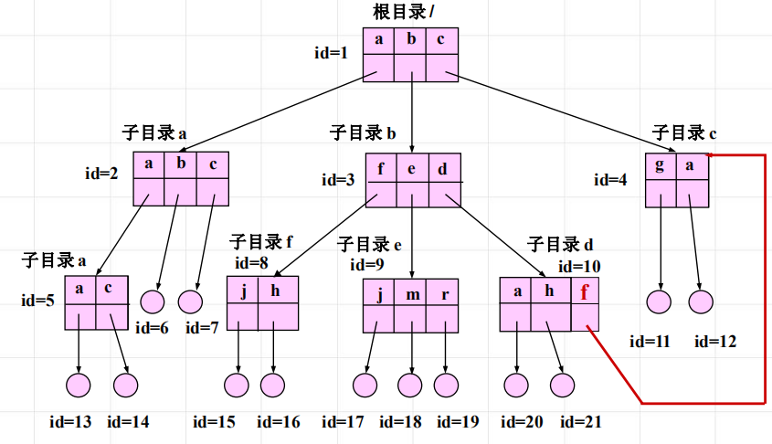

<!--
 * @Descripttion: 
 * @version: 
 * @Author: WangQing
 * @email: 2749374330@qq.com
 * @Date: 2020-01-05 18:08:48
 * @LastEditors: WangQing
 * @LastEditTime: 2020-01-05 18:11:49
 -->
# 文件共享与安全

文件共享是指某一个或某一部分文件可以让事先规定的某些用户共同使用

所谓文件安全，就是文件的保护问题。文件的保护是指文件本身不得被未经文件主授权的任何用户存取，而对于授权用户也只能在允许的存取权限内使用文件

**当前目录**
**链接技术**
