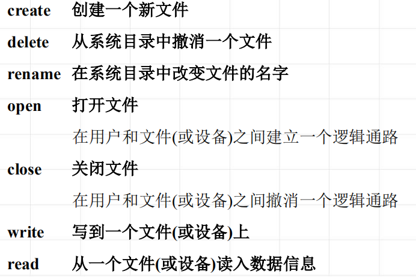

<!--
 * @Descripttion: 
 * @version: 
 * @Author: WangQing
 * @email: 2749374330@qq.com
 * @Date: 2020-01-05 18:12:14
 * @LastEditors: WangQing
 * @LastEditTime: 2020-01-05 18:13:33
 -->
# 文件操作和文件备份

## 文件操作

## 文件备份

为了能在软、硬件失效的意外情况下恢复文件，保证文件的完整性、数据的连续可利用性，文件系统提供适当的机构，以便复制备份