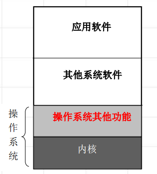
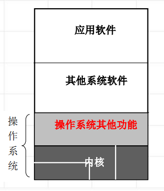
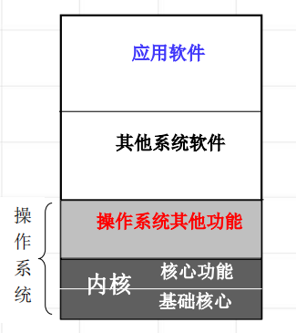
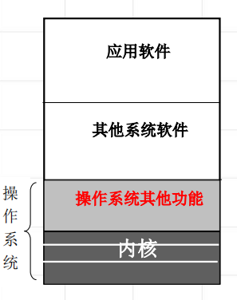
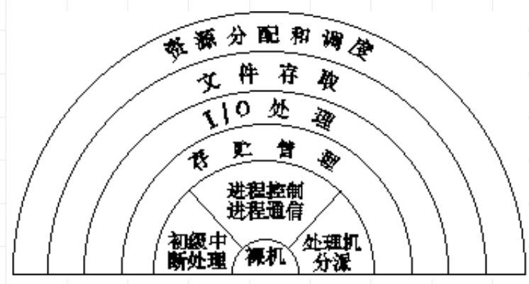

<!--
 * @Descripttion: 
 * @version: 
 * @Author: WangQing
 * @email: 2749374330@qq.com
 * @Date: 2019-12-24 20:07:18
 * @LastEditors  : WangQing
 * @LastEditTime : 2019-12-24 20:20:51
 -->
# 操作系统的结构

## 操作系统的结构类型

- 一体化结构

- 模块化结构

- 可扩展内核结构

- 层次结构

## 操作系统的层次结构

