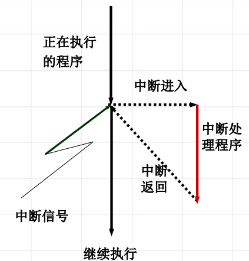
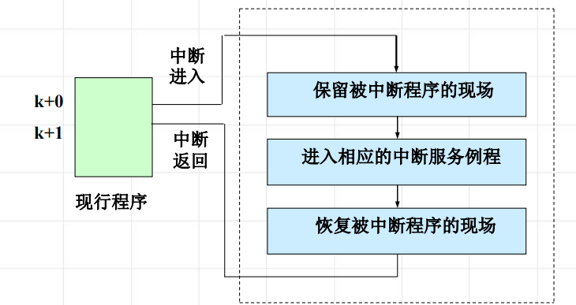

<!--
 * @Descripttion: 
 * @version: 
 * @Author: WangQing
 * @email: 2749374330@qq.com
 * @Date: 2019-12-24 20:21:26
 * @LastEditors: WangQing
 * @LastEditTime: 2019-12-24 20:38:08
 -->
# 中断及其处理

当某件事件发生，系统中止正在运行的程序，对事件进行处理，处理完毕后返回断点继续执行

## 中断类型

### 按功能分类

- 输入输出中断
    - I/O传输结束或出错中断
- 外中断
    - 时钟中断、操作员控制台中断、通信中断...
- 机器故障中断
    - 电源故障、主存取指令错
- 程序性中断
    - 定点溢出、用户态下用核态指令、非法操作
- 访管中断
    - 对操作系统提出某种需求时所发出的中断

### 按中断方式分类

- 强迫性中断
    - 不是正在运行的程序所期待的中断
- 自愿中断
    - 运行程序所期待的中断

### 按中断来源分类

- 中断
    - 由处理机外部事件引起的中断
- 俘获
    - 由处理机内部事件引起的中断

## 中断响应

### 保护现场和恢复现场

- 现场
    - 在中断的时刻确保程序继续运行的相关信息
        - 后续指令所在内存的单元号
        - 程序运行所处的状态
        - 程序执行的情况
        - 程序执行的中间结构
- 保护现场
    - 中断发生时，必须立即把现场信息保存在主存中
- 恢复现场
    - 中断处理完毕后，把保留的现场信息从主存中送至相应的指令计数器、通用寄存器或一些特殊的寄存器中

### 实质

交换指令地址以及处理机的状态信息

## 软件中断处理

