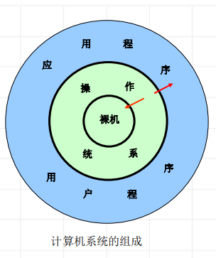

<!--
 * @Descripttion: 
 * @version: 
 * @Author: WangQing
 * @email: 2749374330@qq.com
 * @Date: 2019-12-23 18:54:19
 * @LastEditors: WangQing
 * @LastEditTime: 2019-12-23 19:22:26
 -->
# 操作系统与计算机体系结构的关系

## 操作系统与各层之间的关系

- OS对各层的管理与控制
    - 与硬件的关系
        - 控制CPU的工作
        - 访问存储器
        - 设备驱动、中断处理
    - 与用户以及其他软件的关系
        - 控制、管理
        - 提供方便的用户界面
        - 提供优质的服务
- 各层对OS的制约和影响
    - 下层硬件环境的制约
        - 提供OS运行环境
        - 限制了OS的功能实现
    - 用户和上层软件的要求
        - 用户需求
        - 提供优质的服务
        - 方便的用户界面

## 存储程序式计算机的结构和特点

- 基本部件
    - CPU
    - 存储器
    - I/O设备
- 特点：集中顺序过程控制
    - 过程性：模拟人们手工操作
    - 集中控制：CPU集中管理
    - 顺序性：程序计数器

## 计算机系统结构与操作系统的关系

- 结构特征
    - 计算机系统结构为顺序计算模型
    - 操作系统为并行计算模型
- OS采用的软件技术
    - 多道程序设计技术
    - 分时技术
    - 资源分配与调度
- 计算机体系结构与硬件技术的变化
    - 计算机网络（多计算机系统） <-- 单CPU计算机 --> 消息传递型多计算机
