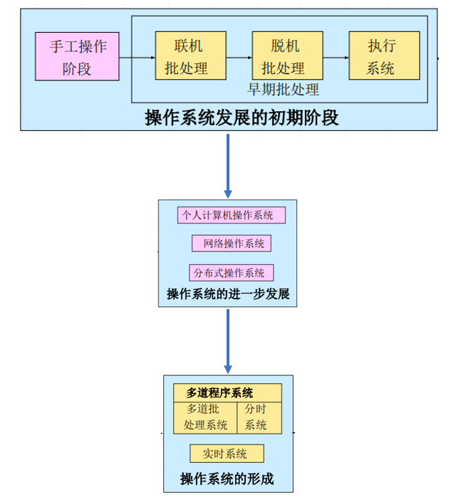
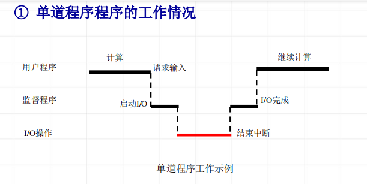
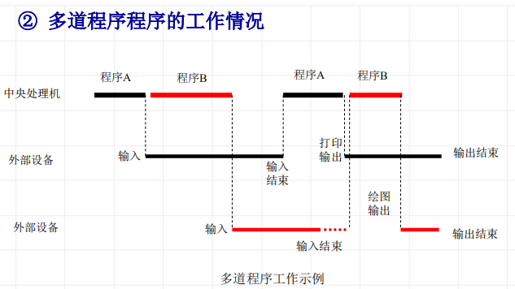

<!--
 * @Descripttion: 
 * @version: 
 * @Author: WangQing
 * @email: 2749374330@qq.com
 * @Date: 2019-12-23 19:22:51
 * @LastEditors  : WangQing
 * @LastEditTime : 2019-12-23 19:52:41
 -->
# 操作系统的形成与发展

## 手工操作阶段

- 特点：无任何软件
    - 有人工干预
    - 独占性
    - 串行性
- 问题
    - CPU速度提高时出现了人机矛盾

## 批处理阶段

### 联机批处理
    
- 特点
    - 监督程序
    - 作业自动过滤
- 问题
    - CPU高速与I/O慢速的矛盾
- 解决办法
    - 由卫星机负责I/O

### 脱机批处理

- 特点
    - 主机与卫星机并行操作
- 问题
    - 调度不灵活
    - 保护问题
- 解决办法
    - 硬件技术的发展
        - 通道技术
        - 中断技术

## 执行系统

借助于通道与中断技术，由主机控制的I/O工作。原有的监督程序不仅要负责调度作业自动地运行，而且还要提供I/O控制功能。它常驻内存，成为执行系统。

- 特点
    - 主机、外设并行操作
    - 增强了保护功能
- 基本功能
    - I/O控制功能
    - 调度
- 问题
    - 主机与外设的并行是有限度的，还依赖于程序运行的特征

## 操作系统的形成

### 多道程序设计技术

在计算机主存中同时存放几道相互独立的程序。这些程序在管理程序控制之下，相互穿插的运行。当某道程序因某种原因不能继续运行下去时，管理程序便将另一道程序投入运行

- 特征
    - 多道
    - 宏观上并行
    - 微观上串行

### 分时技术

把处理机时间划分成很短的时间片轮流分配给各个应用程序使用，如果某个程序在分配的时间片用完之前计算还未完成，该程序就暂时中断，等待下一轮继续计算

- 分时处理
    - 一台计算机与许多终端设备连接，终端用户以联机方式使用计算机

### 实时技术

计算机对于外来信息能够在被控对象允许的截止期限内做出反应

- 实时处理
    - 实时处理以快速反应为特征，对实时信号能够在截止期限内处理并做出反应
    - 实时处理具有实时性和可预测性

## 计算机体系结构与操作系统的关系

- 单CPU计算机配置的操作系统
- 具有并行结构的计算机系统配置的操作系统