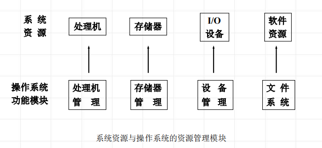

<!--
 * @Descripttion: 
 * @version: 
 * @Author: WangQing
 * @email: 2749374330@qq.com
 * @Date: 2019-12-23 20:05:28
 * @LastEditors: WangQing
 * @LastEditTime: 2019-12-23 20:11:41
 -->
# 操作系统的资源管理功能

## 处理机管理

- 提出进程调度策略
- 给出进程调度算法
- 进行处理机的分派

## 存储器管理

- 存储分配和存储无关性
- 存储保护
- 存储扩充

## 设备管理

- 设备无关性
- 设备分配
- 设备的传输控制

## 信息管理（文件系统）