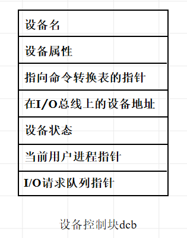

<!--
 * @Descripttion: 
 * @version: 
 * @Author: WangQing
 * @email: 2749374330@qq.com
 * @Date: 2020-01-05 15:13:00
 * @LastEditors  : WangQing
 * @LastEditTime : 2020-01-05 16:52:47
 -->
# 设备管理概述

## 设备分类

- 存储设备
    - 存储设备又称块设备，是存储信息的设备，如：磁盘、磁鼓 (以块为单位传输信息) 。
- 输入输出设备
    - 输入输出设备又称字符设备，能将信息从计算机外部输入到机内，或反之，如：键盘、显示器、打印机 (以字符为单位传输信息) 。
- 通信设备
    - 通信设备负责计算机之间的信息传输，如调制解调器、网卡等。

## 设备管理的目标

- 提高设备利用率
    - 合理分配设备
    - 提高设备与CPU、各外部设备之间的并行性
- 方便用户的使用
    - 提供使用方便且独立于设备的界面
    - 统一：对各种不同的设备提供一致的界面
    - 独立于设备：用户使用的设备与物理设备无关

## 设备管理的三大功能
- 状态跟踪
    - 动态地记录各种设备的状态。设备状态信息保留在设备控制块中。
- 设备分配与回收
    - 静态分配 —— 应用程序级
        - 程序进入系统时进行分配，退出系统时收回全部资源。
    - 动态分配 —— 进程级
        - 进程提出设备申请时进行分配，使用完毕后立即收回。
- 设备控制
    - 实施设备驱动和中断处理的工作。

## 设备独立性

**设备独立性概念**
- 什么是设备独立性
	- 所谓设备独立性是指，用户在程序中使用的设备与实际使用的设备无关，也就是在用户程序中仅使用逻辑设备名。
- 逻辑设备名
    - 逻辑设备名，是用户自己指定的设备名 (或设备号)，它是暂时的、可更改的。
- 物理设备名
    - 物理设备名，是系统提供的设备的标准名称，它是永久的、不可更改的。

**两种类型的设备独立性**
- 一个程序独立于分配给它的某种类型的具体设备
- 程序应尽可能与它所使用的I/O设备类型无关 

**设备独立性的实现**
- 在高级语言中用软通道实现
- 在批处理系统中，用联接说明语句来定义
- 在交互系统中，用指派命令来定义

**设备独立性的优点**
- 方便用户
- 改善设备利用率
- 提高系统的可扩展性和可适应性

## 设备控制块（DCB）

系统为每一台设备都配置了一个用来记录设备的硬件特性、连接和使用情况的一组数据，称为设备控制块

