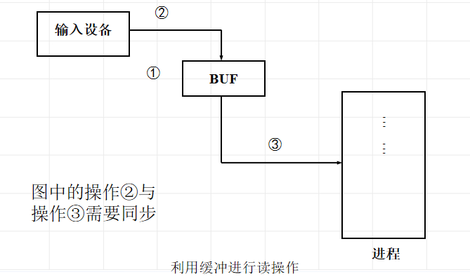
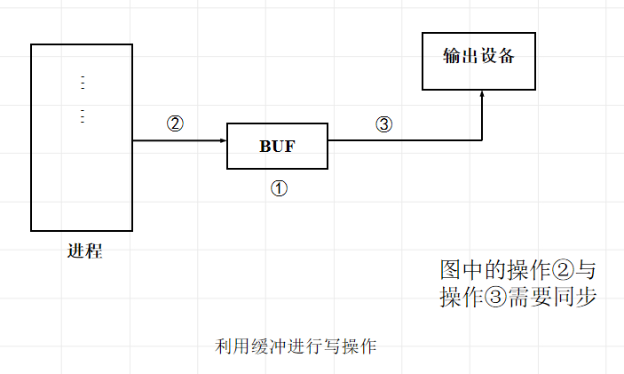

<!--
 * @Descripttion: 
 * @version: 
 * @Author: WangQing
 * @email: 2749374330@qq.com
 * @Date: 2020-01-05 15:38:16
 * @LastEditors: WangQing
 * @LastEditTime: 2020-01-05 16:46:32
 -->
# 缓冲技术

## 缓冲概念

缓冲是两种不同速度的设备之间传输信息时平滑传输过程的常用手段

**缓冲类型**

- 缓冲器
    - 缓冲器是用来暂时存放数据的一种存储装置，它容量较小，存取速度快
- 软件缓冲
    - 在I/O操作期间用来临时存放I/O数据的一块存储区域

**为什么引入缓冲**

- 处理数据流的生产者与消费者间的速度差异
- 协调传输数据大小不一致的设备
- 应用程序的拷贝语义

## 利用缓冲技术如何进行I/O操作

- 进程活动期间，请求从某字符设备读入数据

- 进程活动期间，请求从输出设备输出数据

## 常见的缓冲技术

- 双缓冲
    - 在双缓冲方案下，为输入或输出分配两个缓冲区buf1 、buf2
- 环形缓冲
- 缓冲池