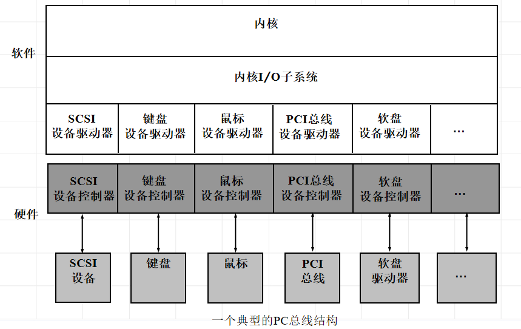
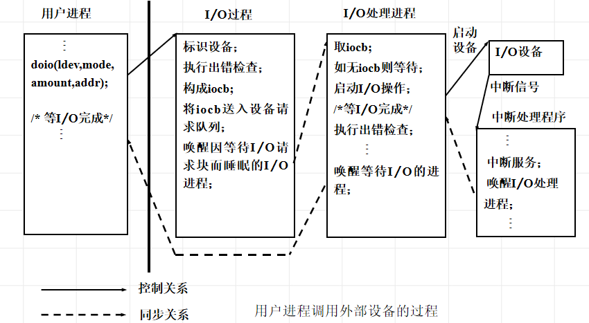

<!--
 * @Descripttion: 
 * @version: 
 * @Author: WangQing
 * @email: 2749374330@qq.com
 * @Date: 2020-01-05 16:52:34
 * @LastEditors: WangQing
 * @LastEditTime: 2020-01-05 17:11:26
 -->
# 输入/输出控制

## 输入/输出控制方式

CPU通过I/O控制器与物理设备打交道。按照I/O控制器智能化程度的高低，将I/O设备的控制方式分为四类。
- 循环测试I/O方式
- I/O中断方式
- 通道方式 
- DMA方式

## I/O子系统

**特点**
- 在应用层为用户提供 I/O应用接口
- 每个通用设备类型都通过一组标准函数 (及接口)来访问

**功能**
- 解释用户的I/O系统调用      
- 设备驱动
- 中断处理

**控制I/O核心模块的方式**
- 以设备处理进程的方式
- 将设备与文件一样对待

## 请求I/O的进程、I/O过程、设备处理进程、中断处理程序之间的同步关系

