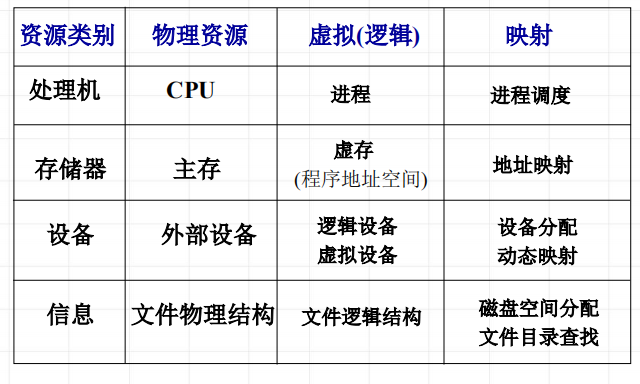

<!--
 * @Descripttion: 
 * @version: 
 * @Author: WangQing
 * @email: 2749374330@qq.com
 * @Date: 2020-01-02 19:41:25
 * @LastEditors: WangQing
 * @LastEditTime: 2020-01-02 20:02:42
 -->
# 资源管理概述

## 资源管理的任务

- 资源数据结构的描述
    - 包含资源的物理名、逻辑名、类型、地址、分配状态等信息。
- 确定资源的分配原则 (调度原则)
    - 决定资源应分给谁，何时分配，分配多少等问题。
- 实施资源分配
    - 执行资源分配；资源收回工作。
- 存取控制和安全保护
    - 对资源的存取进行控制并对资源实施安全保护措施

## 资源管理的静态分配和动态分配

- 资源的静态分配
    - 系统对作业一级采用资源静态分配方法。系统在调度作业时，根据作业所需资源进行分配；并在作业运行完毕时，收回所分配的全部资源。这种分配通常称为资源的静态分配。
- 资源的动态分配
    - 系统对进程一级采用资源动态分配方法。系统在进程运行中，根据进程提出的资源需求，进行资源的动态分配和回收。这种分配通常称为资源的动态分配。

## 虚拟资源

用户使用的逻辑资源，这是经过操作系统改造的、使用方便的虚资源，而不是物理的、实际的资源

**目的**
- 方便用户使用
- 资源可动态分配，提高资源利用率

