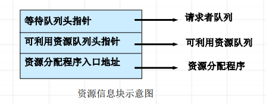
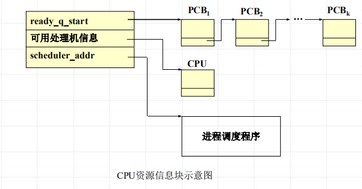
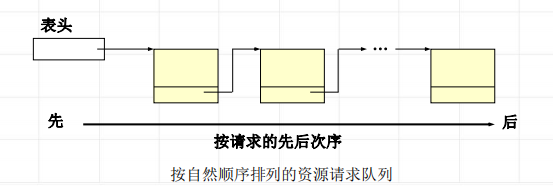
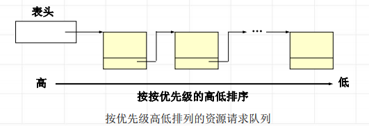

<!--
 * @Descripttion: 
 * @version: 
 * @Author: WangQing
 * @email: 2749374330@qq.com
 * @Date: 2020-01-02 20:03:01
 * @LastEditors: WangQing
 * @LastEditTime: 2020-01-02 20:16:32
 -->
# 资源分配的结构与策略

## 资源分配的结构

**资源描述器**

描述各类资源的最小分配单位的数据结构称为资源描述器 rd（resource 
descriptor）。 如：主存分区分配方法中，最小分配单位为主存分区。 

资源名、资源类型、最小分配单位的大小、地址、分配标志、描述器链接信息、存取权限、密级、存取时间

**资源信息块**

描述某类资源的请求者、可用资源和该类资源分配程序等必要信息的数据结构

## 资源分配策略

**先请求先服务**

- 每一个新产生的请求均排在队尾；
- 当资源可用时，取队首元素，并满足其需要。

**优先调度**

- 对每一个进程指定一个优先级，优先级反映了进程要求处理的紧迫程度；
- 每一个新产生的请求，按其优先级的高低插到相应的位置；
- 当资源可用时，取队首元素，并满足其需要。

**针对设备特征的调度**