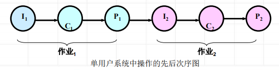
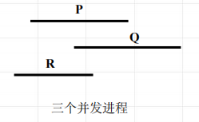

<!--
 * @Descripttion: 
 * @version: 
 * @Author: WangQing
 * @email: 2749374330@qq.com
 * @Date: 2020-01-01 21:24:51
 * @LastEditors: WangQing
 * @LastEditTime: 2020-01-01 21:36:55
 -->
# 进程引入

## 顺序程序及特点

程序的一次执行过程称为一个**计算**，它由许多简单操作所组成

一个计算的若干操作必须按照严格的**先后次序顺序地执行**，这类计算过程就是程序的顺序执行过程



**特点**

- 顺序性
    - 处理机的操作严格按照程序所规定的顺序执行
- 封闭性
    - 程序一旦开始执行，其计算结果不受外界因素的影响
- 可再现性
    - 程序执行的结果与它的执行速度无关 (即与时间无关)，而只与初始条件有关

## 并发程序

若干个程序段同时在系统中运行，这些程序段的执行在时间上是重叠的，**一个程序段的执行尚未结束，另一个程序段的执行已经开始**，即使这种重叠是很小的一部分，也称这几个程序段是并发执行的



```
cobegin
    S1;S2;...Sn;
coend
```

**特点**

- 失去程序的封闭性和可再现性
- 程序与计算不再一一对应
- 程序并发执行的相互制约
    - 间接的相互制约关系 —— 资源共享
    - 直接的相互制约关系 —— 公共变量

## 与时间有关的错误

程序并发执行时，若共享了公共变量，其执行结果与各并发程序的相对速度有关，即给定相同的初始条件，若不加以控制，也可能得到不同的结果，此为与时间有关的错误