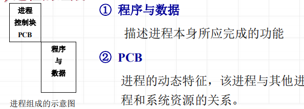
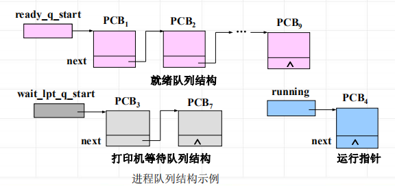

<!--
 * @Descripttion: 
 * @version: 
 * @Author: WangQing
 * @email: 2749374330@qq.com
 * @Date: 2020-01-01 21:37:06
 * @LastEditors: WangQing
 * @LastEditTime: 2020-01-01 21:49:15
 -->
# 进程概念

## 定义

**进程**就是一个程序在给定活动空间和初始环境下，在一个处理机上的执行过程。

**进程与程序的区别**
- 程序是静态的概念，进程是动态的概念；
- 进程是一个独立运行的活动单位；
- 进程是竞争系统资源的基本单位；
- 一个程序可以对应多个进程，一个进程至少包含一个程序

## 进程的状态及变迁

**进程的基本状态**
- 运行状态(running)
    - 该进程已获得运行所必需的资源，它的程序正在处理机上执行
- 等待状态(wait)
    - 进程正等待着某一事件的发生而暂时停止执行。这时，即使给它CPU控制权，它也无法执行
- 就绪状态(ready)
    - 进程已获得除CPU之外的运行所必需的资源，一旦得到CPU控制权，立即可以运行

## 进程描述

描述进程与其他进程、系统资源的关系以及进程在各个不同时期所处的状态的数据结构，称为**进程控制块PCB**

