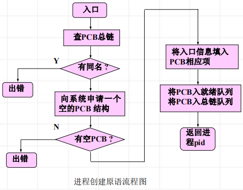
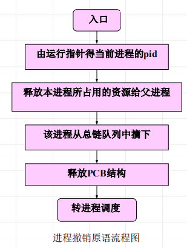
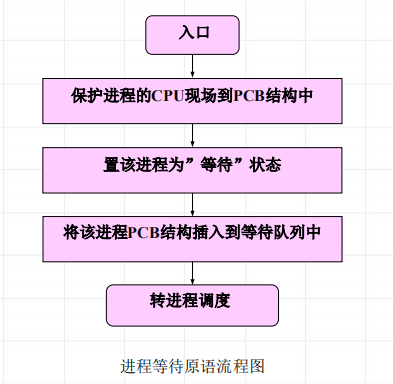
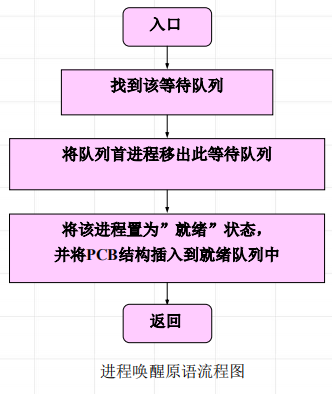

<!--
 * @Descripttion: 
 * @version: 
 * @Author: WangQing
 * @email: 2749374330@qq.com
 * @Date: 2020-01-01 21:49:22
 * @LastEditors: WangQing
 * @LastEditTime: 2020-01-01 21:58:54
 -->
# 进程控制

对系统中的进程实施有效的管理，负责进程状态的改变

## 进程创建

```c++
create (name，priority) 
// 创建一个具有指定标识符的进程，建立进程的PCB结构
// name为被创建进程的标识符
// priority为进程优先级
```


## 进程撤销

撤消当前运行的进程。将该进程的PCB结构归还到PCB资源池，所占用的资源归还给父进程，从总链队列中摘除它，然后转进程调度程序，kill (或exit)



## 进程等待

```c++
susp(chan)
// 中止调用进程的执行，并加入到等待chan的等待队列中；最后使控制转向进程调度
// 入口参数chan：进程等待的原因
```



## 进程唤醒

```c++
wakeup(chan)
// 当进程等待的事件发生时，唤醒等待该事件的进程
// 入口参数chan：进程等待的原因
```

