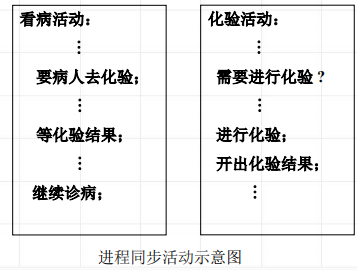
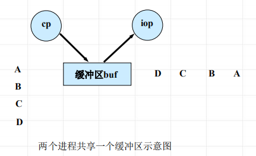

<!--
 * @Descripttion: 
 * @version: 
 * @Author: WangQing
 * @email: 2749374330@qq.com
 * @Date: 2020-01-01 21:59:13
 * @LastEditors: WangQing
 * @LastEditTime: 2020-01-01 22:05:08
 -->
# 进程之间的约束关系

## 进程互斥

- 临界资源
    - 一次仅允许一个进程使用的资源称为临界资源
- 临界区
    - 临界区是进程中对公共变量 (或存储区)进行访问与修改的程序段，称为相对于该公共变量的临界区
- 互斥
    - 在操作系统中，当某一进程正在访问某一存储区域时，就不允许其他进程来读出或者修改存储区的内容，否则，就会发生后果无法估计的错误。进程间的这种相互制约关系称为互斥。

## 进程同步

并发进程在一些关键点上可能需要互相等待与互通消息，
这种相互制约的等待与互通消息称为进程同步

