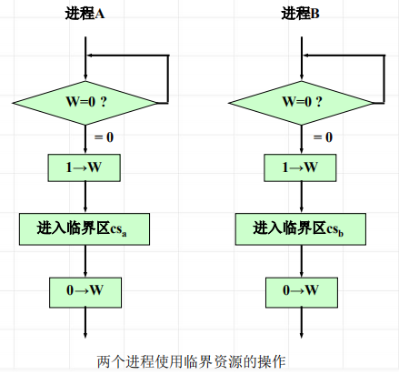

<!--
 * @Descripttion: 
 * @version: 
 * @Author: WangQing
 * @email: 2749374330@qq.com
 * @Date: 2020-01-01 22:05:27
 * @LastEditors: WangQing
 * @LastEditTime: 2020-01-01 22:10:17
 -->
# 进程同步机构

## 锁和上锁、开锁操作

用变量w代表某种资源的状态，w称为“锁”

- 检测w的值 (是0还是1)；
- 如果w的值为1，继续检测；
- 如果w的值为0，将锁位置1 (表示占用资源)，进入临界区执行。 (此为上锁操作)

## 信号灯和P、V操作

信号灯是一个确定的二元组 (s，q)，s是一个具有**非负初值的整型变量**，q是一个初始状态为空的队列。操作系统利用信号灯的状态对并发进程和共享资源进行控制和管理。

对信号灯s的 p操作记为 p(s)。p(s)是一个不可分割的原语操作，即取
信号灯值减1，若相减结果为负，则调用p(s)的进程被阻，并插入到
该信号灯的等待队列中，否则可以继续执行

对信号灯s的 v操作记为 v(s)。v(s)是一个不可分割的原语操作，即取
信号灯值加1，若相加结果大于零，进程继续执行，否则，要帮助唤
醒在信号灯等待队列上的一个进程