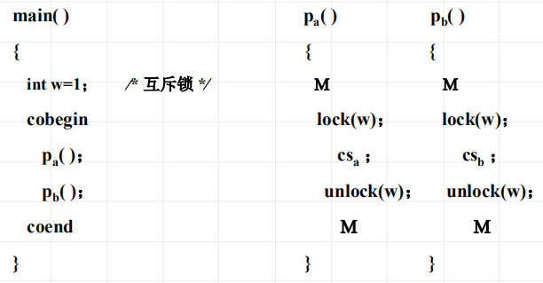
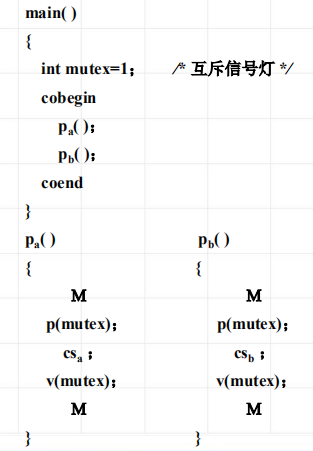
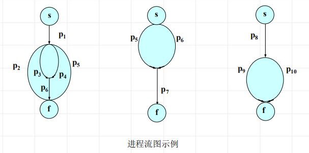
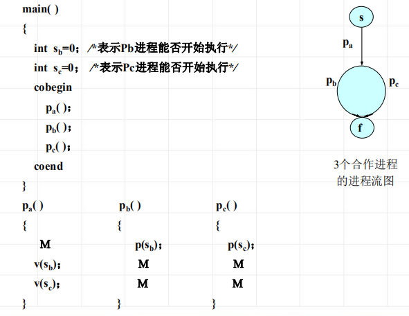
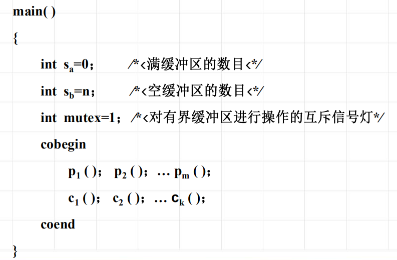
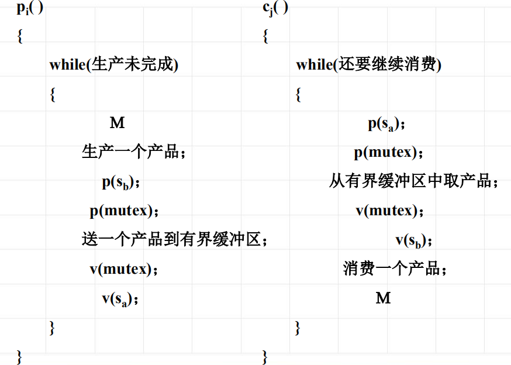

<!--
 * @Descripttion: 
 * @version: 
 * @Author: WangQing
 * @email: 2749374330@qq.com
 * @Date: 2020-01-01 22:11:57
 * @LastEditors: WangQing
 * @LastEditTime: 2020-01-01 22:29:36
 -->
# 进程互斥与同步的实现

## 上锁原语和开锁原语实现进程互斥

## P、V操作实现进程互斥

## 同步实现

## 生产者——消费者问题

